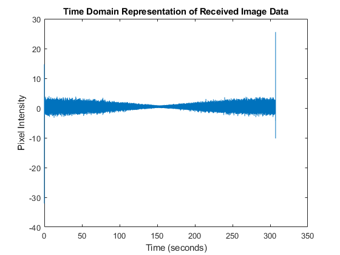
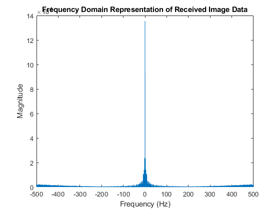
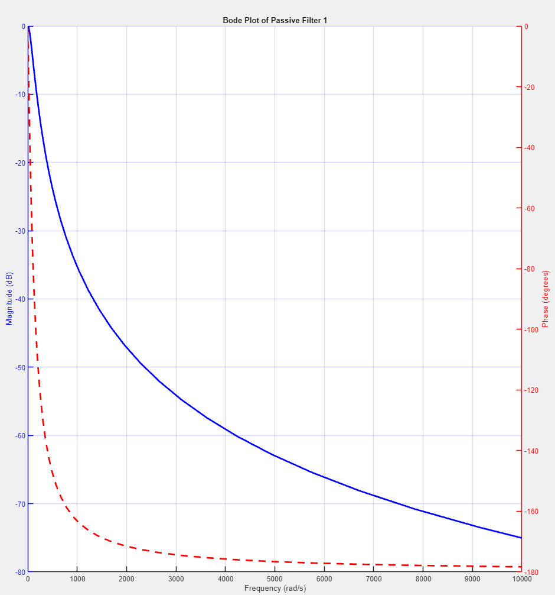
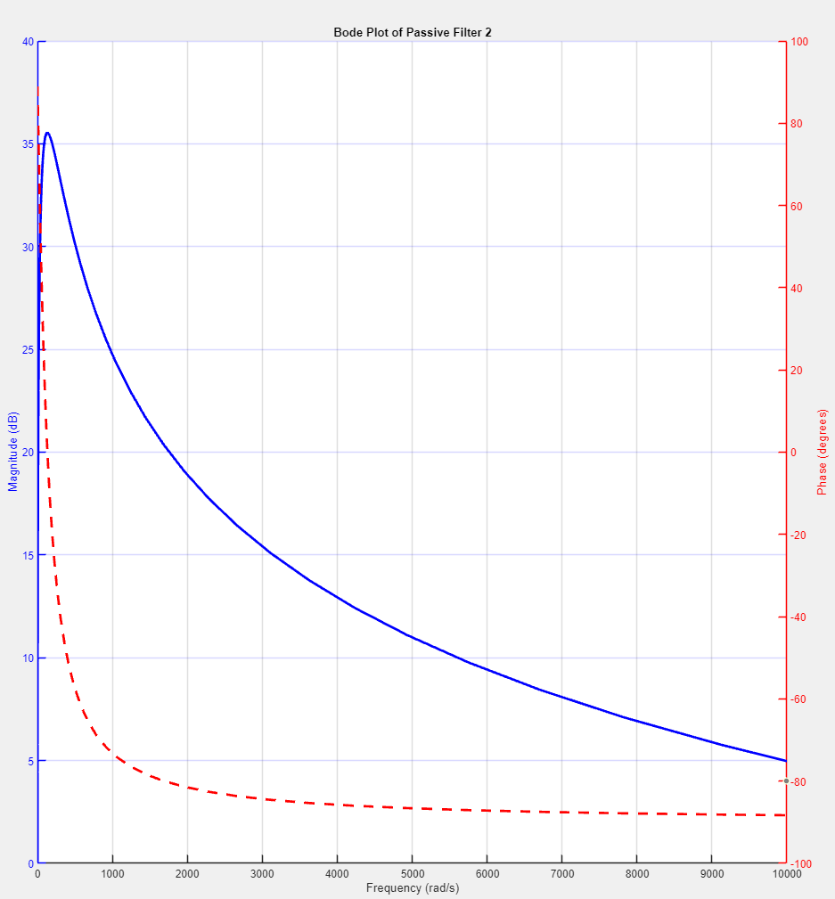
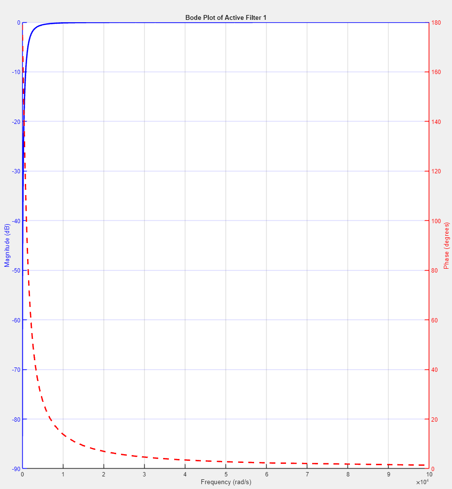
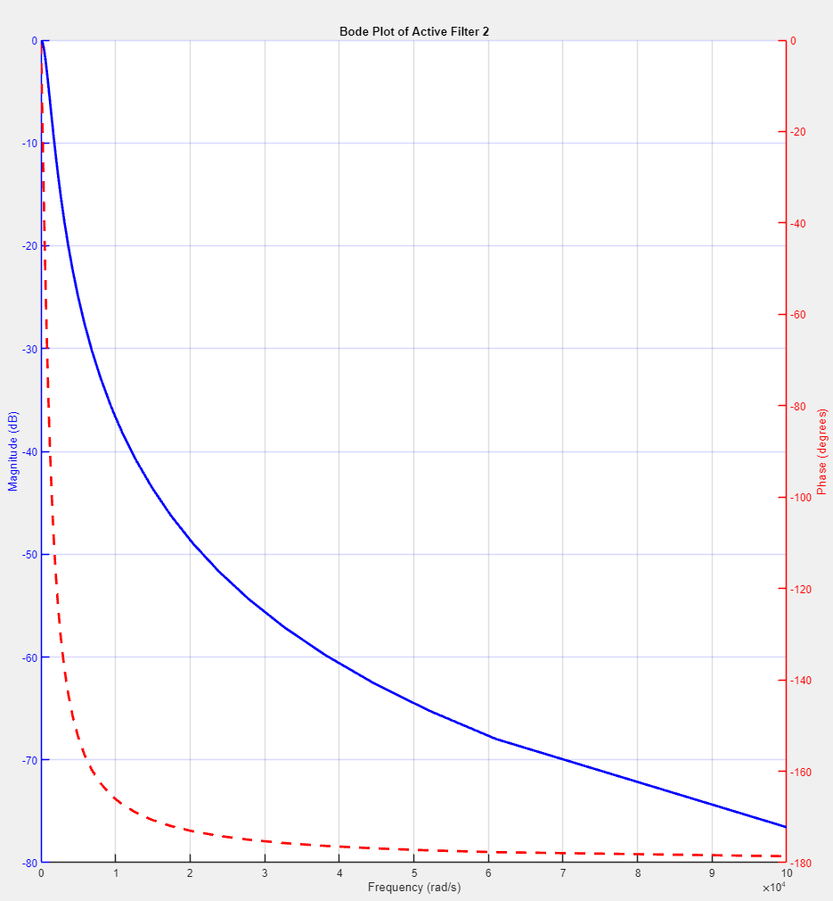

# BASA National Space Program: Radio Frequency and Telecommunication Division

**Group Number:** 98  
**Group Members:** Parker Rennie (n11543043), Jack Bowen (n10765395), Deven Johnson (n12031615)  
**Unit Name:** Signal Analysis
**Unit Code:** EGB242 

## Table of Contents

0. [Introduction](#introduction)
1. [Section 1: De-noising the Communication Channel](#section-1-de-noising-the-communication-channel)
   - [1.1 Audio Signal Analysis](#11-audio-signal-analysis)
   - [1.2 Demodulation of Audio Signals](#12-demodulation-of-audio-signals)
   - [1.3 Modeling Frequency-Dependent Distortion](#13-modeling-frequency-dependent-distortion)
   - [1.4 & 1.5 Noise Reduction & Application](#14--15-noise-reduction-application)
2. [Section 2: Rover Camera Control](#section-2-rover-camera-control)
   - [2.1 DC Motor Modeling](#21-dc-motor-modeling)
   - [2.2 Feedback System Integration](#22-feedback-system-integration)
   - [2.3 System Dynamics Analysis](#23-system-dynamics-analysis)
   - [2.4 Gain Adjustment Analysis](#24-gain-adjustment-analysis)
   - [2.5 Control System for Panoramic Views](#25-control-system-for-panoramic-views)
   - [2.6 Panorama Capture Task](#26-panorama-capture-task)
3. [Section 3: Choosing a Landing Site](#section-3-choosing-a-landing-site)
   - [3.1 Initial Image Analysis](#31-initial-image-analysis)
   - [3.2 Signal Analysis](#32-signal-analysis)
   - [3.3 Filter Selection](#33-filter-selection)
   - [3.4 Noise Removal and Image Cleanup](#34-noise-removal-and-image-cleanup)
   - [3.5 Full Image Set Processing](#35-full-image-set-processing)
4. [Conclusion](#conclusion)
5. [Reflection](#reflection)
   - [Learning & Understanding](#learning--understanding)
   - [Challenges & Limitations](#challenges--limitations)
   - [Future Improvements](#future-improvements)
   - [Teamwork & Collaboration](#teamwork--collaboration)
6. [References](#references)
7. [Appendices](#appendices)
   - [Appendix A: MATLAB Source Code](#appendix-a-matlab-source-code)
      - [Section 1: Main Source Code](#section-1)
         - [Channel Analysis App](#channel-analysis-app)
         - [Signal Visualization App](#signal-visualization-app)
         - [Audio Playback App](#audio-playback-app)
   - [Appendix B: Additional Material](#appendix-b-additional-material)

---

## Introduction
Following the success of the communication system developed during our initial placement at BASA, our team has been given an important role in the primary engineering team for the next crewed Mars expedition. We have made several improvements to improve performance further, building on the results of Assignment 1, where the system successfully kept clear and dependable contact between mission control and the spacecraft.

This expedition plans to send a rover to investigate the proposed settlement location for humans on Mars to create a permanent human habitat. The primary improvements include the use of Fourier Series in sophisticated noise reduction algorithms to get rid of the periodic noise and provide cleaner audio transmission. The method of converting analogue to digital has also been improved to lower latency and improve signal integrity. These improvements are essential as our team prepares for the MARS-242 mission.

Our work is divided into three main sections:
De-noising the Communication Channel: The spacecraft that is travelling towards Mars has been equipped with the communication system that was developed in Assignment 1. As the spacecraft leaves Earth's atmosphere, atmospheric distortions cause the audio to become inaudible even though the radio transmitter and receiver operate as designed. A colleague has created a more realistic channel model that includes additive noise and distortions that vary with frequency. To guarantee clear communication, we aim to describe and counteract these noise processes.

Rover Camera Control: Upon arrival, the astronauts will send out a rover to explore prospective landing locations on Mars. The rover will send pictures of these locations back to the spaceship so the astronauts can decide on a secure landing spot. The rover's camera angle and axis are essential to this procedure since it has to spin on its yaw axis to properly photograph the Martian terrain.

Choosing a Landing Site: Once the rover has successfully taken images of possible landing locations, the photos will be sent to BASA Headquarters, where an appropriate landing spot will be selected. Our team will also have to filter the extra noise the communication channel produces for the visual signals.

---

## Section 1: De-noising the Communication Channel

### 1.1 Audio Signal Analysis

#### Objective
The aim of this task is to use the sample audio signal provided, `audioMultiplexNoisy`, and the provided sampling rate `fs`. This section will model the multiplexed audio signal in the time and frequency domain in order to illuminate the individual signals before multiplexing. This will also discuss any potential noise introduced by the channel after modulation.

#### Method
After loading `audioMultiplexNoisy` and `fs` from DataA2, the signal was first plotted in the time domain after expressing it as a time vector. The choice to apply a Hamming window was made because it offers a good balance between reducing spectral leakage and maintaining frequency resolution, which is particularly important when analyzing signals that may contain closely spaced frequency components (National Instruments, n.d.).

The Hamming window reduces spectral leakage, helping to more clearly distinguish the frequency components of the signal. After applying the Hamming window, the Fast Fourier Transform (FFT) was computed to convert the time-domain signal into the frequency domain. This allows for the analysis of the signal's spectral content.

A frequency vector was created and centred at 0 Hz to aid in visualizing the frequency components accurately. Finally, the FFT result was shifted using fftshift to centre the zero-frequency component, and the magnitude of the frequency components was plotted against frequency. This frequency-domain plot provides insight into the spectral characteristics of the multiplexed audio signal.

#### Results

***Figure 1:** Recorded Audio Waveform in the Time Domain. This plot represents the amplitude of the noisy multiplexed audio signal over a 20-second time span, visualizing the time-domain behaviour of the signal.*


***Figure 2:*** *Frequency Domain Plot of the Multiplexed Audio Signal. This plot shows the magnitude of the signal's frequency components, providing insight into the spectral characteristics of the signal after applying a Hamming window and computing the FFT.*

#### Analysis
As shown in **Figure 1**, the time-domain plot reveals a noisy signal with a broad range of amplitudes, indicating a composite of several frequencies and possibly some interference. The lack of periodicity suggests complex or multiplexed signal sources. **Figure 2** demonstrates how the application of a Hamming window helped in minimizing spectral leakage, allowing for a clearer view of the frequency components. Significant peaks in the frequency-domain plot indicate dominant frequencies within the audio signal, which are crucial for further analysis and filtering or demodulation. This detailed visualization of both time and frequency domains is essential for understanding the content and quality of the multiplexed signal and for any subsequent efforts to isolate or modify specific components of the audio.

### 1.2 Demodulation of Audio Signals

#### Objective
The aim of this analysis is to demodulate the multiplexed audio signals identified from a noisy environment. Using the demultiplexing system developed earlier, we locate the carrier frequencies of each modulated audio signal, demodulate each audio stream, assess the sound quality, and provide visualizations in both the time and frequency domains.

#### Method
A demultiplexing system was employed to identify and isolate carrier frequencies from the composite signal. After detecting the carrier frequencies, each associated signal was demodulated using a combination of the Hilbert transform and a bandpass filter tailored to the audio bandwidth specifications. Here's why these methods were chosen:

1. **Carrier Frequency Detection**: Carrier frequencies were detected using a peak detection method on the Fourier-transformed signal. This approach helps in identifying the precise frequencies where the signal components are concentrated, which are necessary for accurate demodulation. An example of how this was implemented is as below.

```matlab
systemA = abs(fft_shifted_center);
%% Set peak values to filter out rogue frequencies
minPeakProminenceA = max(systemA) * 0.1;
minPeakDistanceA = 10000;

%% Took positive frequencies due to Fourier Symetry
positive_freqsA = fA(fA >= 0);
system_positiveA = systemA(fA >= 0);

%% Found peaks of carrier frequencies
[pkzA, loczA] = findpeaks(system_positiveA, 'MinPeakProminence', minPeakProminenceA, 'MinPeakDistance', minPeakDistanceA);
detected_carrier_frequenciesA = positive_freqsA(loczA);
```

2. **Hilbert Transform**:
   - The Hilbert transform is used to obtain the analytic signal from the real signal. The analytic signal consists of the original signal and its Hilbert transform, forming a complex signal.
   - This transform is crucial for demodulation as it helps in isolating the amplitude envelope and instantaneous phase, which are modulated around the carrier frequency.
   - Reference: (WaveMetrics, n.d.)

3. **Bandpass Filter**:
   - After shifting the frequency spectrum of the modulated signal to baseband using the Hilbert transform, a bandpass filter is applied. The purpose of the bandpass filter is to limit the frequency range to the essential bandwidth of the audio signal, typically around 20 Hz to 20 kHz for audible signals (Purves et al., 2001).
   - This filtering removes out-of-band noise and other spectral components that are not relevant to the audio content, thus enhancing the quality of the demodulated signal.

The combination of these techniques ensures that each demodulated signal is cleared of unnecessary spectral noise and retains only the audio frequencies of interest.

#### Results

***Figure 3:** Detected Carrier Frequencies in the Positive Frequency Range. Carrier frequencies are marked on the magnitude spectrum, indicating the presence of five distinct carrier signals.*


***Figure 4:** Demodulated Audio Signal 1 (Carrier: 8260 Hz). Time domain (top) shows the amplitude of the audio over time, while the frequency domain (bottom) displays the magnitude spectrum post-demodulation.*


***Figure 5:** Demodulated Audio Signal 2 (Carrier: 24240 Hz). The time domain graph indicates a relatively stable amplitude, and the frequency domain highlights dominant frequency components.*


***Figure 6:** Demodulated Audio Signal 3 (Carrier: 40260 Hz). Displays the time-domain waveform and its corresponding frequency spectrum, emphasizing the audio signal's detailed characteristics after demodulation.*


***Figure 7:** Demodulated Audio Signal 4 (Carrier: 56100 Hz). Shows amplitude fluctuations over time and a clear spectral view illustrating the effects of demodulation on the audio signal.*


***Figure 8:** Demodulated Audio Signal 5 (Carrier: 72080 Hz). Both the time and frequency domain plots reveal the audio signal's characteristics, with evident frequency peaks corresponding to the audio content.*

#### Analysis
- **Audio Quality**: Listening tests for each demodulated signal (as referenced in Figures 4 to 8) indicate a significant improvement in audio clarity, with a reduction in background noise musical tones.
- **Residual Noises**: Some residual noises that match the noise spectrum modelled in **Figure 1** of Section 1.1 are still present. These are likely artifacts from the original noising process and the carrier modulation. In particular the single tone noise.
- **Time and Frequency Domain Insights**:
  - The time domain plots (top graphs in Figures 4 to 8) show the waveform's amplitude variations over time, which are smooth and consistent, suggesting effective demodulation.
  - The frequency domain plots (bottom graphs in Figures 4 to 8) demonstrate clean spectral lines with the absence of high-frequency noise, indicating successful removal of the carrier frequencies and isolation of the audio signal.
- **Effectiveness of Demodulation**: The clarity in the frequency domain across all demodulated signals confirms that the carrier frequencies have been effectively removed, validating the demodulation process.

The analysis confirms that the demodulation process has successfully isolated each audio signal, reducing noise and improving audio quality. The persistence of some noise elements as originally modelled suggests areas for further refinement in the demultiplexing system or noise reduction techniques.

### 1.3 Modeling Frequency-Dependent Distortion

#### Objective
To model the frequency-dependent distortion introduced by a communication channel, characterized as a Linear Time-Invariant (LTI) system. The output \( y(t) \) is the convolution of the input signal \( x(t) \) with the channel's impulse response \( h(t) \):
\[ y(t) = x(t) * h(t) \]
We use the function `channel(sid, x, fs)` to simulate this behaviour in a controlled environment.

#### Method
To accurately characterize the channel's impulse response \( h(t) \), we require a test signal \( x(t) \) that can effectively probe the channel's behaviour across its operational bandwidth. While the Dirac delta function \( \delta(t) \) is ideal mathematically for its ability to reproduce the impulse response directly due to its sifting property:
\[ \delta(t) * h(t) = h(t) \]
it is impractical in real-world applications due to its infinite amplitude at \( t = 0 \) and zero elsewhere, making it impossible to physically generate.

Instead, a **chirp signal** is chosen:
\[ x(t) = \sin\left(2\pi f(t) t\right) \]
where \( f(t) \) linearly increases from 0 to \( \frac{fs}{2} \) over the duration of the signal. This chirp sweeps through all the frequencies in the desired range, allowing us to analyze how the channel affects different frequencies.

Mathematically, the chirp signal's interaction with the channel provides a comprehensive view of the frequency-dependent behaviour:
\[ y(t) = (\sin(2\pi f(t) t) * h(t) \]
This convolution shows how the amplitude and phase of each frequency component are modified by \( h(t) \), giving a detailed picture of the channel's characteristics.

The analysis involved transmitting a chirp signal through the channel and measuring both the input and output signals in the time domain, as well as estimating the frequency response of the channel.

#### Results


***Figure 9:** Time-Domain Signals. The plot shows the input chirp signal (in blue) and the output signal (in red) as processed by the channel. The differences between these two signals reflect the distortions and modifications imparted by the channel. Additionally, Estimated Frequency Response |H(f)|. This plot represents the magnitude of the channel's frequency response derived from the ratio of the FFT of the output signal to the FFT of the input signal, demonstrating how various frequency components are affected by the channel. This was generated by using the channel analysis application built for this task with inputs of 5ms.*

#### Analysis

- **Time-Domain Analysis**:
  - The input chirp signal (blue) displays a clean and predictable frequency sweep over time.
  - The output signal (red) shows considerable distortion, especially noticeable by amplitude changes and phase shifts, which vary across the signal's duration.
  - The distortions in the output signal suggest nonlinearities or time-varying characteristics within the channel, which could be due to components within the channel altering the signal based on its frequency or amplitude.

- **Frequency-Domain Analysis**:
  - The frequency response plot (Figure 9) reveals multiple peaks and troughs, indicating resonant frequencies where the channel amplifies the signal and other frequencies where it attenuates the signal.
  - These variations in the frequency response can be linked to physical or electronic characteristics of the channel, such as capacitive, inductive, or resistive elements that differentially affect signal components.
  - Notably, there are significant deviations from a flat response, which would indicate a perfectly linear channel. This suggests that the channel has a complex response that could potentially introduce artifacts or colouration into transmitted signals.

#### Limitations
- **Time Resolution**: The finite length of the chirp limits the time resolution available for analyzing the channel's response, potentially smoothing over rapid changes in channel behaviour.
- **Frequency Resolution**: The chirp covers a wide frequency range but at the cost of precision in identifying the exact frequency at which certain phenomena occur, especially for very sharp resonances or notches.
- **Assumptions of Linearity**: The analysis assumes the channel behaves linearly, which the time-domain output signal suggests may not be entirely accurate. Nonlinear behaviours require different analytical approaches or signal processing techniques to characterize fully.

### 1.4 & 1.5 Noise Reduction Application

#### Objective
The objective of this task is to apply modelled inverse channel distortions to reduce noise in multiplexed audio signals, followed by the removal of remaining single-tone noises using notch filters, in order to improve the overall audio clarity. 

The two main goals are:
1. Reverse the distortions caused by the channel to restore the original signal.
2. Eliminate any residual noise, particularly the high-pitched single-tone noise, that remains after initial noise reduction.

#### Method
The method for noise reduction consists of two key steps:

##### 1. Inverse Filtering
Inverse filtering aims to correct the frequency-dependent distortion introduced by the communication channel. By using the estimated frequency response \( H(f) \) of the channel, an inverse filter is constructed, effectively reversing the distortion.

1. **Filter Design**: The inverse filter is designed based on the channel's frequency response. A reasonable number of filter coefficients are chosen to ensure that the filter remains computationally feasible while retaining its ability to correct the distortions.
   - A **Hamming window** is applied to the filter coefficients to stabilize the filter by reducing spectral leakage. The Hamming window is chosen because it provides a balance between mainlobe width and sidelobe attenuation, making it ideal for minimizing ringing artifacts in the filtered output.

2. **Inverse FFT Calculation**: After obtaining the frequency response of the channel, the inverse filter is computed by applying the **Inverse Fast Fourier Transform (IFFT)** to the estimated frequency response.
   - The computed IFFT provides the time-domain representation of the inverse filter. Only the first set of coefficients is used, windowed by the Hamming function to smooth the transition between passband and stopband, further enhancing filter stability.

3. **Application**: The designed inverse filter is then applied to the noisy multiplexed audio signal using convolution. This process attempts to reverse the distortions introduced by the channel, producing a denoised signal.

4. **Noise Frequency Detection**: After applying the inverse filter, the **FFT** is computed on the denoised signal. By detecting peaks in the magnitude spectrum, high-pitched noise frequencies are identified. These peaks are expected to correspond to the remaining single-tone noises present in the signal.

##### 2. Single-Tone Noise Removal
After applying the inverse filter, some high-pitched single-tone noise may still persist. These tones are addressed through the following steps:

1. **Bandpass Filtering**: Each carrier frequency is filtered using a **bandpass FIR filter** to isolate the relevant frequency range, allowing us to focus on each component of the multiplexed signal individually.

2. **Hilbert Transform and Envelope Detection**: After isolating the frequency band for each carrier, the **Hilbert transform** is applied to obtain the analytic signal. The envelope (magnitude) of the analytic signal is extracted, representing the original modulated audio signal.

3. **Low-Pass Filtering**: To remove any residual high-frequency content, the envelope is passed through a **low-pass FIR filter**, which suppresses frequencies above 3000 Hz, ensuring that only the audio-relevant frequencies are retained.

4. **Notch Filtering for Noise Removal**: **Notch filters** are applied at the detected noise frequencies, effectively eliminating the high-pitched single-tone noises without affecting the surrounding frequencies. The notch filters are designed as bandstop IIR filters with a narrow stopband centred on the detected noise frequencies.

5. **Dynamic Range Compression**: After noise removal, **dynamic range compression** is applied to balance the audio signal's amplitude. This process ensures that the loudest parts of the audio do not exceed a certain threshold, while quieter parts are amplified, producing a more consistent audio output.

#### Results

The following are the time-domain and frequency-domain visualizations of the processed audio signals for different carrier frequencies:

- **Processed Signal for 8260 Hz**
  
  ***Figure 10:** Shows improvements in waveform smoothness, with the frequency spectrum indicating a significant reduction in noise.*

- **Processed Signal for 24240 Hz**
  
  ***Figure 11:** The time-domain plot demonstrates smoother amplitude variations, and the frequency spectrum shows clearer components with reduced noise artifacts.*

- **Processed Signal for 40260 Hz**
  
  ***Figure 12:** Displays a more consistent waveform in the time domain. The frequency domain plot indicates a clean spectrum with significantly less noise.*

- **Processed Signal for 56100 Hz**
  
  ***Figure 13:** The amplitude in the time domain is more uniform, and the frequency-domain plot reveals cleaner signal characteristics, highlighting effective noise reduction.*

- **Processed Signal for 72080 Hz**
  
  ***Figure 14:** Time-domain shows smoother amplitude, and the frequency-domain plot confirms a notable reduction in background noise, emphasizing the success of the noise reduction techniques.*

#### Analysis

- **Time-Domain Analysis**: The time-domain plots of the processed signals (Figures 10-14) show significant improvements in waveform consistency, with smoother amplitude transitions and less abrupt noise-induced fluctuations.
  
- **Frequency-Domain Analysis**: The frequency-domain plots show a marked reduction in noise across all frequencies. The processed signals demonstrate less spectral energy in areas typically associated with noise, indicating that the inverse filtering and notch filters effectively mitigated unwanted noise components.

- **Noise Reduction Efficacy**: The combined approach of inverse filtering and single-tone noise removal significantly improved the audio quality, reducing background noise and artifacts while maintaining the integrity of the original signal. The effectiveness of the noise reduction can be seen in both the time and frequency domains for all carrier frequencies.

- **Residual Noise**: While the overall noise reduction is substantial, some residual low-level noise may still be present in certain frequencies, particularly in regions where the signal strength is weaker. However, the presence of such noise is minimal and does not significantly affect the overall audio quality. In some cases, the tone is still persistent meaning it was not entirely effective. The playback of the audio signals can be done via an application built for this task `Audio Playback App`.

#### Conclusion

The noise reduction process, which involved inverse filtering and the removal of single-tone noise, has been effective in enhancing the quality of the multiplexed audio signals. The processed signals now exhibit smooth waveforms in the time domain and clean spectra in the frequency domain, indicating successful suppression of unwanted noise components, however in some recordings still persistence of the single-tone noise is evident. Thus other filtering techniques may be required.

---

## Section 2: Rover Camera Control

### 2.1 DC Motor Modeling

#### Objective
In this section, the aim was to develop and analyze the mathematical model of the servo motor controlling the yaw angle, \( \psi(t) \), of a camera mounted on our Mars rover. The model was based on the transfer function in the Laplace domain, given the motor's characteristics with parameters \( K_m = 1 \) and \( \alpha = 0.5 \). The feasibility of the system was evaluated by deriving the step response of the servo motor in the Laplace domain using the given transfer function and performing an inverse Laplace transform to obtain the time-domain representation of the motor's response to a unit step input in voltage. A time vector was generated over the interval \( t \in [0, 20) \) seconds with \( 10^4 \) samples, and both the step input and the corresponding step response were simulated and plotted to visualize how the yaw angle \( \psi(t) \) evolves over time.

#### Method

**Laplace Domain Analysis was conducted:**
The transfer function of the servo motor was defined as:
\[
G_m(s) = \frac{K_m}{s(s + \alpha)}
\]
where \( K_m = 1 \) and \( \alpha = 0.5 \). The Laplace transform of a unit step input voltage, \( U(s) = \frac{1}{s} \), was applied to determine the system's response in the Laplace domain.

**Inverse Laplace Transform was applied:**
The expression obtained from multiplying the motor's transfer function by the unit step input,
\[
\frac{K_m}{s^2(s + \alpha)}
\]
was simplified using partial fractions. The inverse Laplace transform of each term in the partial fraction decomposition was calculated to obtain the time-domain response, \( \psi_{out}(t) \). Resultantly, the system response can be modelled as such:
\[
\psi_{out} = -4 + 2t + 4e^{-0.5t}
\]

**A time vector and simulation were created:**
A time vector \( t \) was generated using `linspace` to produce \( 10^4 \) evenly spaced samples over the interval from 0 to 20 seconds. The step response \( \psi_{out}(t) \) was computed over this time vector using the derived time-domain formula.

**Plotting was performed:**
The step response \( \psi_{out}(t) \) was plotted alongside the step input to visually compare the system's output behaviour to the constant input voltage. Plotting tools that supported annotations and grid lines were utilized to enhance the readability and interpretation of the plot.

This approach provided a systematic exploration of the servo motor's capability to effectively control the yaw angle of a Mars rover’s camera, highlighting areas requiring potential enhancements.

#### Results

***Figure 15:** This graph displays the comparison between the step input and the step response over a time interval of 0 to 20 seconds. The step input, represented as a dashed line, remains constant throughout the period, illustrating the constant voltage applied to the servo motor. The solid line depicts the step response, \( \psi_{out}(t) \), which shows the yaw angle of the camera as it evolves over time due to the applied input voltage. The response increases proportionally with time indicated by its linearity.*

#### Analysis
The response in *Figure 15* clearly illustrates that under a constant input voltage, the camera's yaw angle \( \psi_{out}(t) \) does not converge to a constant value. Instead, it continues to increase linearly with time. The linear behaviour of the response suggests that there is no damping or stabilizing mechanism inherent in the system that would cause the yaw angle to level off or stabilize at a certain point, which could be necessary for precise control and positioning of the camera. Given that the yaw angle does not stabilize, additional control mechanisms, such as feedback systems or damping components, might be required to achieve desired control objectives like reaching and maintaining a specific yaw angle. The system as modelled might be insufficient for tasks that require the camera to fix on a particular target or to perform sweeps and then hold at a specific view, indicating the potential need for revising the motor control strategy or incorporating other elements like sensors and feedback loops. 

### 2.2 Feedback System Integration

#### Objective
The objective of this section was to enhance control of the Mars rover’s camera by integrating a feedback system using a potentiometer. The feedback system aimed to stabilize the yaw angle \( \psi(t) \) and prevent continuous rotation, allowing the camera to hold a specific angular position.

#### Method
To model the feedback system, a potentiometer was added to provide feedback on the motor’s angular displacement. The transfer function for the motor \( G_m(s) \) is:
\[
G_m(s) = \frac{K_m}{s(s + \alpha)}
\]
where \( K_m = 1 \) and \( \alpha = 0.5 \). The feedback from the potentiometer, modelled as \( H_p(s) = K_{pot} = 1 \), was used to adjust the motor’s input by measuring the yaw angle displacement. The closed-loop transfer function for the system became:
\[
F(s) = \frac{G_m(s)}{1 + G_m(s) \cdot H_p(s)}
\]
This transfer function was then simulated using MATLAB’s `tf` object and the `lsim` function, with the same time vector as in section 2.1. The step response of the feedback system was plotted and compared to the open-loop system response.

#### Results


***Figure 16 (Feedback System):** The step response of the feedback system, shown below, demonstrates significant improvement. The feedback introduces oscillations but quickly stabilizes the camera’s yaw angle to the desired value. The system initially overshoots but settles to the steady-state value of 1, which corresponds to the step input. This stabilization occurs due to the corrective action provided by the feedback loop.*

#### Analysis
Comparing the open-loop and feedback systems shows the effectiveness of adding the potentiometer for feedback control. 

- **Without Feedback (Figure 15):** The yaw angle increases linearly and does not stabilize, indicating the system lacks any self-correction mechanism. This makes it unsuitable for controlling angular displacement, as the camera will continue to rotate indefinitely after a step input.

- **With Feedback (Figure 16):** The feedback system, however, introduces damping and control over the yaw angle. The feedback helps the system correct its response and stabilize the yaw angle at the desired value. Although there is some initial overshoot and oscillation, the system eventually settles at the target angle. This behaviour makes the feedback system far more suitable for precise control of the Mars rover’s camera, ensuring that it can lock onto and maintain a specific orientation.

Overall, the feedback system is critical for ensuring stable and controlled operation of the camera’s angular displacement. The oscillations introduced by the feedback loop represent the system’s ability to correct itself over time, achieving stability, which was not possible with the open-loop system.


### 2.3 System Dynamics Analysis

#### Objective
The objective of this section was to analyze the dynamics of the feedback system used for controlling the Mars rover's camera. By determining key parameters such as the natural frequency \( \omega_n \), damping ratio \( \zeta \), time to peak \( T_p \), settling time \( T_s \), and percentage overshoot \( \%OS \), we assess the performance of the system in achieving stable and precise yaw angle control.

#### Method
To analyze the feedback system, we derived the following parameters from the transfer function and the step response of the closed-loop system:
- **Natural Frequency (\( \omega_n \))**: This defines the system’s natural tendency to oscillate without damping.
- **Damping Ratio (\( \zeta \))**: This defines the extent of oscillation damping. A damping ratio between 0 and 1 indicates an underdamped system with oscillations.
- **Time to Peak (\( T_p \))**: The time taken for the system to reach its maximum overshoot.
- **Settling Time (\( T_s \))**: The time required for the system to remain within 2% of its final value.
- **Percentage Overshoot (\( \%OS \))**: The extent to which the system exceeds its final value during oscillations.

The calculations were performed based on the standard formulas for second-order systems, given that the system was identified as underdamped (\( 0 < \zeta < 1 \)).

#### Results
The table below summarizes the key dynamic properties of the feedback system:

| **Parameter**                | **Value**              | **Description**                                                 |
|------------------------------|------------------------|-----------------------------------------------------------------|
| Natural Frequency (\( \omega_n \))  | 1.00 rad/s            | The system oscillates with this frequency in the absence of damping. |
| Damping Ratio (\( \zeta \))        | 0.25                  | The system is underdamped, indicating oscillatory behaviour.        |
| Time to Peak (\( T_p \))            | 3.24 seconds          | Time taken to reach the first peak of overshoot.                  |
| Settling Time (\( T_s \))           | 16.00 seconds         | Time taken for the system to settle within 2% of the final value.  |
| Percentage Overshoot (\( \%OS \))   | 44.43%                | The amount the system overshoots its target value.                |

#### Analysis
The feedback system, while introducing stabilization to the yaw angle, exhibits significant oscillations, as evidenced by the high percentage overshoot of 44.43%. The system's dynamics are as follows:

- **Underdamped behaviour**: With a damping ratio \( \zeta = 0.25 \), the system is underdamped, meaning it exhibits oscillations before reaching a steady state. The overshoot and oscillations, though damped over time, could cause the camera to temporarily exceed its desired angular position.
  
- **Time to Peak**: The system takes approximately 3.24 seconds to reach its first peak. This delay, coupled with the high overshoot, may result in the camera taking longer to stabilize when fine-tuning its position.

- **Settling Time**: The system requires around 16 seconds to settle within 2% of its final value, which might be too long for real-time operations where quick adjustments of the camera’s orientation are critical.

- **High Overshoot**: The percentage overshoot of 44.43% means the yaw angle exceeds the desired position significantly before correcting itself. This is particularly problematic when the camera needs to remain within specific bounds, such as \( 0 \leq \psi(t) \leq 2\pi \) radians. Any overshoot could result in the camera overshooting its target angle and then correcting, causing inefficiency in real-time control.

Given these dynamics, the feedback system as currently designed may not be fully appropriate for controlling the Mars rover's camera, where precision and stability are paramount. To improve the system's suitability, the damping ratio could be increased to reduce oscillations and overshoot, or additional control strategies (such as a PID controller) could be implemented to enhance the system's response.


### 2.4 Gain Adjustment Analysis

#### Objective
The objective of this section was to refine the control of the Mars rover's camera yaw angle by adjusting system gains. Specifically, we introduced forward gain \( K_{fwd} \) and feedback gain \( K_{fb} \) to investigate their effects on the system’s step response. The goal was to find optimal gain settings that minimize overshoot and settling time while ensuring stability and precision in the yaw angle control.

#### Method
To assess the impact of gain changes, we modified the closed-loop transfer function by introducing:
- **Forward gain**: \( G_g(s) = K_{fwd} \)
- **Feedback gain**: \( H_g(s) = K_{fb} \)

Two sets of simulations were conducted:
1. **Varying \( K_{fb} \) while keeping \( K_{fwd} = 1 \)**: The feedback gain \( K_{fb} \) was adjusted through values \( \{0.1, 0.2, 0.5, 1.0, 2.0\} \).
2. **Varying \( K_{fwd} \) while keeping \( K_{fb} = 1 \)**: The forward gain \( K_{fwd} \) was adjusted through values \( \{0.1, 0.2, 0.5, 1.0, 2.0\} \).

For each combination, we simulated the system using MATLAB and plotted the step response to compare the effects of varying the gains.

#### Results
  
  

  ***Figure 16:** Step Response for Varying \( K_{fb} \) with \( K_{fwd} = 1. \) As \( K_{fb} \) increases, the system's response becomes more stable, with a reduction in overshoot and quicker settling time. Higher values of \( K_{fb} \) (e.g., 2.0) result in a smoother response, while lower values (e.g., 0.1) cause the system to overshoot significantly, with a longer settling time.*
<p>
  
  

  ***Figure 17:** Step Response for Varying \( K_{fwd} \) with \( K_{fb} = 1.\) Adjusting \( K_{fwd} \) changes the aggressiveness of the system's response. Higher values of \( K_{fwd} \) (e.g., 2.0) lead to significant oscillations and overshoot, while smaller values (e.g., 0.1) provide a more controlled response with reduced oscillations. However, very low values of \( K_{fwd} \) can make the system too sluggish.*

#### Analysis
From the results:
1. **Feedback Gain \( K_{fb} \)**: Increasing \( K_{fb} \) reduces overshoot and improves stability. For example, \( K_{fb} = 2.0 \) provides a more damped response with minimal oscillations, making it suitable for precise control of the camera's yaw angle. However, too high a feedback gain may lead to under-responding to input changes.

2. **Forward Gain \( K_{fwd} \)**: Higher values of \( K_{fwd} \) cause the system to respond more aggressively, increasing overshoot and causing oscillations. Moderate values of \( K_{fwd} \) (around 1.0) offer a balanced response, but careful tuning is required to avoid excessive oscillations and instability.

In conclusion, the feedback gain \( K_{fb} \) plays a crucial role in stabilizing the system, and the forward gain \( K_{fwd} \) must be chosen carefully to avoid excessive oscillations while maintaining responsiveness. For this system, a higher \( K_{fb} \) (e.g., 2.0) combined with a moderate \( K_{fwd} \) (e.g., 1.0) provided the best overall performance for controlling the Mars rover’s camera.


### 2.5 Control System for Panoramic Views

#### Objective
The primary objective of this section was to fine-tune the control system of the Mars rover's camera to facilitate panoramic sweeps across the Mars landscape. The control system needed to be configured to allow the camera to rotate smoothly and precisely through a full range of 0 to \(2\pi\) radians, without exceeding the operational constraints that could result in blurred images due to too rapid movement.

#### Method
The method involved iterative adjustments to the gain settings of the control system. Based on previous sections' analyses, the key focus was on:
- Increasing the forward gain \( K_{fwd} \) to enhance the responsiveness of the system, allowing it to reach the desired angular range within a specified time frame.
- Maintaining the feedback gain \( K_{fb} \) to ensure system stability and avoid overshoots that could lead to oscillations or instability in the camera movement.

Specifically, the following steps were taken:
1. **Determine the desired natural frequency and damping ratio** from the system's requirements for a smooth and controlled motion.
2. **Calculate and adjust the forward and feedback gains** based on the desired time to peak and the full angular rotation requirement.
3. **Simulate the system** with the new settings to observe the response and ensure it meets the panoramic requirements.

#### Results
The final transfer function, denoted as `cameraTF`, was configured with the adjusted gain settings. The forward gain \( K_{fwd} \) was set to approximately 0.300, and the feedback gain \( K_{fb} \) was maintained at approximately 0.125. The system's response with these settings was simulated to verify the performance.

The simulation results confirmed that the system could now effectively sweep the camera through a full rotation of \(2\pi\) radians in less than 20 seconds, achieving a smooth and controlled motion suitable for capturing high-quality panoramic images.


***Figure 18:** Improved Step Response of the Camera Control System showcasing the capability to reach over \(2\pi\) radians within 20 seconds, tailored for panoramic sweeps.*

#### Analysis
The analysis of the step response and the system's overall behaviour with the adjusted gains indicated several key points:
- **System Responsiveness:** The increased \( K_{fwd} \) effectively shortened the time required for the camera to reach the full rotational range, addressing the initial sluggishness observed in prior configurations.
- **Stability and Control:** The feedback gain \( K_{fb} \) ensured that despite the increased speed, the system remained stable without significant overshoots or oscillations, crucial for maintaining image clarity during movement.
- **Operational Efficiency:** The system meets the operational requirements for capturing panoramic views on Mars, with a motion profile that aligns well with the camera's specifications to avoid motion blur.

In conclusion, the camera control system is now optimally configured to perform sweeping panoramas of the Mars landscape, ensuring high-quality image capture with precise and controlled rotational movements.

### 2.6 Panorama Capture Task

#### Objective
The objective of this task was to capture a panoramic sweep on Mars using the Mars rover's camera system. The sweep aimed to cover a specific angular range from 30° to 210°, providing a broad view of the landing site to aid in orienting the rover and planning subsequent missions.

#### Method
The control system was implemented with the following calibrated settings to ensure precise control over the camera's rotational movement:

- **Start Angle**: 30°, corresponding to 0.52 radians.
- **End Angle**: 210°, corresponding to 3.67 radians, adjusted to correct for a previously observed endpoint of 228°.
- **Voltage Settings**: The start voltage was set at 0.08 V, and the end voltage was initially calculated at 0.58 V but corrected to ensure the camera stops precisely at 210°.

The process involved:
1. **Converting angles to radians** for internal calculations.
2. **Mapping these radians to voltages** that the camera control system uses to position the camera.
3. **Executing the panorama** through the `cameraPan` function, which utilizes the camera control system's transfer function (`cameraTF`) to drive the camera from the start voltage to the corrected end voltage.

#### Results
The panoramic sweep was successfully captured as planned:

- **Starting Image**: The panorama began at an angle of 30°, providing an initial view of the Mars terrain directly in front of the rover.
- **Final Image**: The sweep concluded at the corrected angle of 210°, showing a comprehensive view extending to the far landscape features, useful for mission planning and navigation.


***Figure 19:** Starting and Final Images from the Panoramic Sweep on Mars*

The adjusted settings resulted in a smooth panoramic sweep, achieving the desired angular coverage without any observable overshoot or instability in the camera movement.

#### Analysis
The panoramic sweep demonstrated that the adjusted voltage settings effectively compensated for any previous discrepancies in the camera's angular placement. The resulting images show a clear and stable transition from the start to the end point of the desired panorama:

- **Voltage Calibration**: The adjustments to the end voltage ensured that the camera did not overshoot the intended final angle, addressing the initial 18° discrepancy effectively.
- **Panoramic Coverage**: The sweep covered the intended angles, providing valuable visual data from the Mars surface.
- **System Performance**: The camera control system responded accurately to the voltage inputs, confirming the effectiveness of the calibration process and the reliability of the system under Martian conditions.

This task's success is pivotal for the ongoing exploration and utilization of visual data in planning the rover's movements and activities on Mars.

---

## Section 3: Choosing a Landing Site

### 3.1 Initial Image Analysis

#### Objective
The primary objective of this analysis is to assess the first received image of a potential landing site on Mars. This assessment aims to identify and characterize noise and other distortions that might affect the usability of the image for mission planning.

#### Method
The received image was displayed and examined to evaluate its quality. The main focus was on identifying noise patterns and any distortions that could compromise the image's clarity and usefulness for identifying suitable landing terrain.

#### Results
The first received image shows significant visual noise, impacting the overall clarity:

- **Visual Quality**: The image displays a considerable amount of graininess, with noise distributed across the entire image. This graininess could mask finer surface details that are crucial for assessing the landing site's safety.
- **Noise Characteristics**: The noise pattern appears uniform, suggesting it might be due to electronic or transmission noise rather than environmental factors on Mars.
- **Detail Obscuration**: The noise level is high enough that smaller features such as rocks or smaller geographical formations might not be distinguishable. This could complicate the assessment of potential hazards at the landing site.


*Figure 20: First Received Image of Landing Site*

#### Analysis
The quality of the image as received is suboptimal for detailed analysis due to the high level of noise. This could be attributed to several factors:

- **Transmission Issues**: The noise pattern suggests issues with the communication channel, possibly a high level of electronic interference or a suboptimal transmission bitrate.
- **Sensor Sensitivity**: The camera sensor's sensitivity to the Martian environment or the rover's electronic environment might need calibration to reduce the noise.
- **Potential Remedies**: Applying digital filters or enhancing techniques might improve the image quality for better analysis. Further adjustments in the rover’s communication hardware or protocols might also be required to enhance future image transmissions.

Given the current state of the image, it is recommended to conduct a more detailed analysis using advanced image processing techniques to filter out noise and enhance the image. This process should be repeated with subsequent images to ensure consistent improvements in image quality for mission-critical decisions.

### 3.2 Signal Analysis

#### Objective
The aim of this analysis is to examine the received image data of a potential Mars landing site in both time and frequency domains to understand the characteristics of the signal and identify any noise components affecting the data.

#### Method
The analysis involved constructing time and frequency vectors for the received signal of the image. This allowed us to visualize and assess how the image data is represented in these domains:

- **Time Domain Analysis**: A time vector was created to plot pixel intensity values against time, reflecting how data is received over the transmission period.
- **Frequency Domain Analysis**: A frequency vector was generated using the Fourier Transform of the image data to observe the distribution of signal energy across different frequencies.

#### Results
Upon examining the plots:

- **Time Domain Representation**:
  - The plot shows a relatively stable signal with minor fluctuations in pixel intensity, indicating a stable transmission with low-level noise.
  - A sharp spike is observed towards the end, which could indicate a transmission error or an anomaly in data capture or processing.
  - 
  ***Figure 21:** Time Domain Representation of Received Image Data*

- **Frequency Domain Representation**:
  - The majority of the signal's energy is concentrated at very low frequencies, which is typical for image data where major variations are gradual changes in intensity across the image.
  - The presence of a significant peak at zero frequency suggests a DC component, which is common in image data representing the overall brightness of the image.
  - Noise appears to be spread across the higher frequencies but is not dominant, indicating that the transmission channel is relatively clean with only minor noise interference.
  - 
  ***Figure 22:** Frequency Domain Representation of Received Image Data*

#### Analysis
- **Nature of the Noise**: The noise in the signal appears to be low-frequency and high-frequency white noise, which is commonly associated with electronic transmission systems. The high-frequency noise components are less intense, suggesting that they do not significantly impact the overall quality of the image.
- **Frequency Range/Bandwidth of the Noise**: Noise is observed across a broad range of frequencies but is predominantly noticeable in the higher frequencies beyond approximately 50 Hz. This indicates that filtering techniques could be employed to clean up the image without affecting the primary content, which resides in the lower frequency band.

- **Signal Characteristics**: The sharp spike in the time domain may need further investigation to ensure it does not represent a systematic error or artifact that could mislead analysis or interpretation of the landing site's imagery.

Overall, the analysis confirms that while there is some noise present in the signal, the primary content of the image—representative of the Mars surface—is intact and predominantly clear of severe distortions. This suggests that the communication channel, despite minor imperfections, effectively transmits usable image data. Advanced filtering techniques could be employed to enhance the image further by reducing high-frequency noise.


### 3.3 Filter Selection

#### Objective
The objective of this section is to determine the most appropriate filter for removing noise from the communication channel of the Mars rover’s camera signal. Several filter designs are provided, including both passive and active filters, and they need to be analyzed based on their transfer functions, Bode plots, and suitability for the task.

#### Method
The analysis was conducted using the transfer functions of the four filters:

1. **Passive Filter 1**: A combination of RC high-pass and low-pass filters.
2. **Passive Filter 2**: A two-stage RC low-pass filter.
3. **Active Filter 1**: A second-order band-pass filter.
4. **Active Filter 2**: A second-order low-pass filter.

The general form of the transfer functions for the filters was derived based on their circuit configurations and component values:

- **Passive Filter 1:**
  \[
  \frac{V_{out}}{V_{in}} = \frac{1}{(R_1 C_1)(R_2 C_2) s^2 + (R_1 C_1 + R_2 C_2) s + 1}
  \]
- **Passive Filter 2:**
  \[
  \frac{V_{out}}{V_{in}} = \frac{s}{(R_1 C_1)(R_2 C_2) s^2 + (R_1 C_1 + R_2 C_2) s + 1}
  \]
- **Active Filter 1:**
  \[
  \frac{V_{out}}{V_{in}} = \frac{s^2}{s^2 + \frac{2s}{RC} + \frac{1}{(RC)^2}}
  \]
- **Active Filter 2:**
  \[
  \frac{V_{out}}{V_{in}} = \frac{1/(RC)^2}{s^2 + \frac{2s}{RC} + \frac{1}{(RC)^2}}
  \]

We used the following component values in the analysis:
- **R1 = 1.2 kΩ**, **C1 = 10 μF**, **R2 = 1 kΩ**, **C2 = 4.7 μF**, **R = 820 Ω**, and **C = 1 μF**.

These values were substituted into the transfer function formulas to generate the filter coefficients for each circuit, and the frequency response of each filter was analyzed by generating Bode plots.

#### Results

1. **Passive Filter 1**
   - **Bode Plot**:  
   

   ***Figure 23:** Passive Filter 1 shows a significant drop-off in gain at high frequencies, typical of an RC filter. The cutoff frequency is fairly high, meaning that while some high-frequency noise would be filtered, low-frequency noise would likely still pass through. This may limit its effectiveness in removing the broad range of noise identified in the signal.*

2. **Passive Filter 2**
   - **Bode Plot**:  
   

   ***Figure 24:** Passive Filter 2, being a two-stage low-pass filter, shows more attenuation at higher frequencies compared to Passive Filter 1. Its cutoff frequency is lower, which helps filter out a wider range of high-frequency noise. However, it may not fully address noise in the mid-frequency range.*

3. **Active Filter 1**
   - **Bode Plot**:  
   

   ***Figure 25:** Active Filter 1 functions as a band-pass filter. The Bode plot shows it has a relatively narrow passband, which could isolate the desired signal from mid-range noise. However, it may allow low-frequency noise through and could also fail to suppress some high-frequency noise components.*

4. **Active Filter 2**
   - **Bode Plot**:  
   

   ***Figure 26:** Active Filter 2 is a low-pass filter with a lower cutoff frequency than the other filters, making it ideal for attenuating a broad range of high-frequency noise. It provides a steep roll-off in gain at high frequencies and shows strong suppression of higher-frequency noise while preserving the lower-frequency signal components.*

#### Analysis

Based on the Bode plot analysis and the noise characteristics of the received signal, **Active Filter 2** appears to be the most suitable choice. The following factors contribute to this decision:

1. **Attenuation of High-Frequency Noise**: Active Filter 2 provides the strongest attenuation of high-frequency noise, which was identified as the primary source of interference in the received signal.
2. **Cutoff Frequency**: The low cutoff frequency of Active Filter 2 ensures that a significant amount of the high-frequency noise is eliminated while maintaining the integrity of the lower-frequency image signal.
3. **Steeper Roll-Off**: Compared to the passive filters, Active Filter 2 has a much steeper roll-off, meaning that unwanted high-frequency noise is removed more effectively.
4. **Broad Applicability**: Unlike Active Filter 1, which has a narrow passband and would only be effective in certain frequency ranges, Active Filter 2 is suitable for filtering noise across a wider range of frequencies.

While Passive Filter 2 provides better attenuation than Passive Filter 1, neither offers the degree of noise suppression necessary for the communication system. **Active Filter 2** combines the advantages of a low cutoff frequency and steep roll-off, making it the best choice for this application.

#### Conclusion
After analyzing all four filters, **Active Filter 2** was selected as the most appropriate filter for removing noise from the communication channel. It provides effective high-frequency noise attenuation while preserving the integrity of the signal in the lower-frequency range, which is essential for ensuring clear image transmission from the Mars rover.

### 3.4 Noise Removal and Image Cleanup

#### Objective
Apply the selected filter to clean the image signal.

#### Method
Implement the filtering process.

#### Results
Display the cleaned image and assess the removal of noise.

### 3.5 Full Image Set Processing

#### Objective
Repeat the noise removal process for all images.

#### Method
Factorize and implement the de-noising process.

#### Results
Display cleaned images and provide landing site recommendations.

---

## Conclusion

*Summarize the key findings, the effectiveness of the noise removal and control systems, and any conclusions drawn from the project.*

This assignment revealed several key findings about audio and visual data processing:

The initial range of the signal's amplitudes and lack of periodicity demonstrated the complexity of the audio sources. Using a Hamming window minimized spectral leakage, making it easier to identify some of the frequencies essential for filtering and demodulation.

Implementing inverse filtering and single-tone noise removal significantly enhanced the audio signal's quality. While there was still some single-tone noise residue, the need for additional filtering techniques was evident to achieve optimal results.

When controlling the yaw angle, adjusted voltage settings effectively fixed any discrepancies with the camera angle, ensuring smooth panoramic sweeps. This calibration was crucial for stable, clear imaging from the Mars rover.

Active Filter Selection: Among the four filters analyzed, Active Filter 2 proved to be the most effective for high-frequency noise reduction, whish is crucial for image transmission from the Mars rover.

The successful noise reduction and voltage calibration processes are pivotal for ongoing Mars exploration, enabling better planning and execution of the rover's activities. Further refinement and additional filtering techniques can always improve the transmissions and may address remaining noise issues. 

## Reflection
### Learning & Understanding
As a group we learned the importance of precise signal processing techniques to enhance data quality, The application of Hamming windows effectively reduced spectral leakage of our signal, revealing critical frequency components. It was evident that noise reduction methods like inverse filtering improved audio signal clarity, highlighting the need for advanced filtering techniques.

### Challenges & Limitations
Some of the significant challenges we faced during the project included dealing with persistent single-tone noise despite initial filtering efforts, this noise could be addressed with future improvements. Another constraint we faced was the 18° discrepancy in the camera's angular placement, this required meticulous voltage calibration. Limitations arose from the need for more sophisticated filtering methods to eliminate noise and enhance image clarity for accurate analysis.

### Future Improvements
Future assignments could benefit from more advanced noise reduction techniques to reduce the remaining single-tone noise discrepancies. Enhancing voltage calibration methods could also further improve the accuracy of the rover's panoramic sweeps. Even exploring new filtering technologies may provide more precise solutions for maintaining signal integrity across various frequencies similar to what we used.

### Teamwork & Collaboration
Communication between group members was consistently strong throughout the project. Shortly after the formation of our group, we organised a meeting to discuss our skills and expectations regarding the quality and workload. It was decided that we would regularly update the group on what sections were being worked on and let the team know early on if they were struggling with sections or wanted a second opinion on their contribution.

#### Jack
In completing this task, I acquired a greater understanding of signal processing and the effects of noise audio signal demodualisation. I've particularly learnt about the distortion of signals and how it can be caused by clipping when volume is increased through extensive waveform and frequency analysis. I did however struggle significantly with the coding side of the project and my contribution to the task was limited to the analysis of plots and audio signals that my group members generated. Due to me mainly analysing the plots, I found that I began to recognise trends more easily.

If I was to work on a project like this again, I would go into the assignment with more prior coding knowledge so that I can contribute in a more meaningful and efficient way. There were times where I would have liked to work on the report but I didn't have the skills to generate plots for analysis. Communication between my fellow group members was productive and we always kept eachother in the loop about what content we were working on. We also stored our project files on a GitHub repository so that we could regularly and easily update our report and coding files. In hindsight, we could have organised more meetings/video calls for more focused communication but it wasn't crucial in the end.

---

## References
National Instruments. (n.d.). Understanding FFTs and windowing. Available at: https://download.ni.com/evaluation/pxi/Understanding%20FFTs%20and%20Windowing.pdf.

Purves D, Augustine GJ, Fitzpatrick D, et al., editors. Neuroscience. 2nd edition. Sunderland (MA):Sinauer Associates; 2001. The Audible Spectrum. Available at:https://www.ncbi.nlm.nih.gov/books/NBK10924/

WaveMetrics. (n.d.). Hilbert Transform. Available at: https://www.wavemetrics.com/products/igorpro/dataanalysis/signalprocessing/hilberttransform

---

## Appendices

### Appendix A: MATLAB Source Code

#### Section 1
```matlab
%% EGB242 Assignment 2, Section 1 %%

clear all; close all; clc;

outputDir = 'Output/Data1';
if ~exist(outputDir, 'dir')
    mkdir(outputDir);
end

% Loaded the provided data
load DataA2 audioMultiplexNoisy fs sid;

%% 1.1 Time Domain and Frequency Domain Analysis

audioMultiplexNoisyColumn = audioMultiplexNoisy(:);

t_vec = (0:length(audioMultiplexNoisyColumn) - 1) / fs;

% Plotted Time Domain
fig1 = figure;
plot(t_vec, audioMultiplexNoisyColumn);
xlabel('Time (seconds)');
ylabel('Amplitude');
title('Recorded Audio Waveform in Time Domain');
grid on;
saveas(fig1, '1.1-TimeDomainPlot.png');

% Applied Hamming window to reduce spectral leakage
windowed_audio_signal = audioMultiplexNoisyColumn .* hamming(length(audioMultiplexNoisyColumn));

% Computed FFT of windowed signal
fftaudioMultiplexNoisyColumn = fft(windowed_audio_signal);

% Frequency vector adjusted for fftshift
nA = length(windowed_audio_signal);
fA = (-nA/2:nA/2-1)*(fs/nA);

% Shiftted zero frequency component to center of spectrum
fft_shifted_center = fftshift(fftaudioMultiplexNoisyColumn);

% Plotted frequency domain
fig2 = figure;
plot(fA, abs(fft_shifted_center));
xlabel('Frequency (Hz)');
ylabel('Magnitude');
title('Frequency Domain Plot of Multiplexed Audio Signal');
grid on;
saveas(fig2, '1.1-FrequencyDomainPlot.png');

%% 1.2 De-multiplexing System

% Found peaks in the frequency spectrum to detect carrier frequencies
systemA = abs(fft_shifted_center);
minPeakProminenceA = max(systemA) * 0.1;
minPeakDistanceA = 10000;
positive_freqsA = fA(fA >= 0);
system_positiveA = systemA(fA >= 0);
[pkzA, loczA] = findpeaks(system_positiveA, 'MinPeakProminence', minPeakProminenceA, 'MinPeakDistance', minPeakDistanceA);
detected_carrier_frequenciesA = positive_freqsA(loczA);

fprintf('Detected Carrier Frequencies:\n');
for i = 1:length(detected_carrier_frequenciesA)
    fprintf('%.2f Hz\n', detected_carrier_frequenciesA(i));
end

% Plotted detected peaks on the magnitude spectrum
fig3 = figure;
plot(positive_freqsA, system_positiveA);
hold on;
plot(detected_carrier_frequenciesA, pkzA, 'ro');
xlabel('Frequency (Hz)');
ylabel('Magnitude');
title('Detected Carrier Frequencies in the Positive Frequency Range');
grid on;
hold off;
saveas(fig3, '1.2-DetectedFrequenciesPlot.png');

% Demodulated signals using carrier frequencies
demodulated_signalsA = cell(1, length(detected_carrier_frequenciesA));
for i = 1:length(detected_carrier_frequenciesA)
    fcA = detected_carrier_frequenciesA(i);
    analytic_signalA = hilbert(audioMultiplexNoisyColumn);
    t_vec = (0:length(audioMultiplexNoisyColumn) - 1)' / fs;
    demodulated_complexA = analytic_signalA .* exp(-1j * 2 * pi * fcA * t_vec);
    audio_bandwidthA = 8000;
    cutoff_freqA = audio_bandwidthA / (fs / 2);
    [bA, aA] = butter(6, cutoff_freqA);
    demodulated_signalA = filter(bA, aA, real(demodulated_complexA));
    demodulated_signalsA{i} = demodulated_signalA;

    % Plotted time and frequency domain representations
    figTimeDomain = figure;
    subplot(2,1,1);
    plot(t_vec, demodulated_signalA);
    xlabel('Time (seconds)');
    ylabel('Amplitude');
    title(sprintf('Demodulated Audio Signal %d in Time Domain (Carrier: %.2f Hz)', i, fcA));
    grid on;
    fft_demodulated_signalA = fft(demodulated_signalA);
    n_demodA = length(demodulated_signalA);
    f_demodA = (-n_demodA/2:n_demodA/2-1)*(fs/n_demodA);
    fft_demod_shiftedA = fftshift(fft_demodulated_signalA);
    subplot(2,1,2);
    plot(f_demodA, abs(fft_demod_shiftedA));
    xlabel('Frequency (Hz)');
    ylabel('Magnitude');
    title(sprintf('Demodulated Audio Signal %d in Frequency Domain (Carrier: %.2f Hz)', i, fcA));
    grid on;
    saveas(figTimeDomain, fullfile(outputDir, sprintf('DemodulatedSignal_%dHz.png', fcA)));
end


%% PLAYBACK
num_signalsA = length(demodulated_signalsA);
fprintf('There are %d demodulated signals available.\n', num_signalsA);
fprintf('To play a specific signal, enter a number between 1 and %d.\n', num_signalsA);
fprintf('=================================================================\n\n');
while true
    signal_indexA = input(sprintf('Enter a number between 1 and %d to play a signal, or 0 to quit: ', num_signalsA));
    if signal_indexA == 0
        fprintf('Exiting.\n');
        break;
    elseif signal_indexA >= 1 && signal_indexA <= num_signalsA
        fprintf('Playing demodulated audio for signal %d (Carrier Frequency: %.2f Hz)\n', signal_indexA, detected_carrier_frequenciesA(signal_indexA));
        playback_signalA = demodulated_signalsA{signal_indexA};
        playback_signalA = playback_signalA / max(abs(playback_signalA));
        playerA = audioplayer(playback_signalA, fs);
        play(playerA);
        pause(length(playback_signalA) / fs + 0.5);
        fprintf('Finished playing signal %d.\n\n', signal_indexA);
        fprintf('=================================================================\n\n');
    else
        fprintf('Invalid input. Please enter a number between 1 and %d.\n', num_signalsA);
    end
end

%% Characterized the Channel - 1.3

carrier_frequencies = [72080, 56100, 40260, 24240, 8260];

% 1-second duration for the sweep signal
t_sweep = 0:1/fs:1-1/fs;
% Sweep from 0 Hz to half the sampling rate
sweep = chirp(t_sweep, 0, 1, fs/2);  
output_sweep = channel(sid, sweep, fs);

% Computed the FFT of input and output sweeps
n_sweep = length(sweep);
fft_input_sweep = fft(sweep);
fft_output_sweep = fft(output_sweep);

% Frequency axis for one-sided FFT
frequency_axis_sweep = (0:n_sweep/2-1)*(fs/n_sweep); 

% Calculated the system frequency response
system_frequency_response = abs(fft_output_sweep(1:n_sweep/2)) ./ abs(fft_input_sweep(1:n_sweep/2));
inverse_response = 1 ./ system_frequency_response;
inverse_response(isinf(inverse_response) | isnan(inverse_response)) = 0;

%% Designed an Inverse Filter - 1.4 & 1.5
% Reasonable number of coefficients
numCoeffs = 500;
% Window to stabilize the filter
window = hamming(numCoeffs);  

inverse_response = inverse_response(:).';

% Created full symmetric frequency response for inverse FFT
full_inverse_response = [inverse_response, inverse_response(end-1:-1:2)];

% Computed the inverse FFT to obtain the impulse response of the inverse filter
inverse_filter_coeffs = ifft(full_inverse_response, 'symmetric');

% Took the first numCoeffs coefficients and apply the window
inverse_filter_coeffs = inverse_filter_coeffs(1:numCoeffs) .* window';

% Applied the inverse filter to the noisy multiplexed audio signal
denoised_signal = filter(inverse_filter_coeffs, 1, audioMultiplexNoisy);

% Analyzed the denoised signal to detect high-pitched noise frequencies
n_denoised = length(denoised_signal);
fft_denoised_signal = fft(denoised_signal);
magnitude_spectrum = abs(fft_denoised_signal(1:n_denoised/2));

% Frequency axis for denoised_signal
frequency_axis_denoised = (0:n_denoised/2-1)*(fs/n_denoised);

% Peak detection
[pks, locs] = findpeaks(magnitude_spectrum, ...
    'MinPeakProminence', max(magnitude_spectrum)/20, ...
    'MinPeakDistance', fs/1000);
noise_frequencies = frequency_axis_denoised(locs);

% Displayed detected noise frequencies
disp('Detected Noise Frequencies:');
disp(noise_frequencies);

% Initialized noise_frequencies if no peaks were detected
if isempty(noise_frequencies)
    noise_frequencies = []; 
end

processed_signals = cell(1, length(carrier_frequencies));

for i = 1:length(carrier_frequencies)
    fc = carrier_frequencies(i);

    % Designed a bandpass filter for each carrier frequency
    bpFilt = designfilt('bandpassfir', 'FilterOrder', 100, ...
                        'CutoffFrequency1', fc-1520, 'CutoffFrequency2', fc+1520, ...
                        'SampleRate', fs);

    % Applied the bandpass filter
    filtered_signal = filter(bpFilt, denoised_signal);
    filtered_signal = filtered_signal(:); 

    % Defined time vector as a column vector
    t = ((0:length(filtered_signal)-1)/fs)'; 

    % Demodulated the signal using Hilbert transform (envelope detection)
    analytic_signal = hilbert(filtered_signal);
    envelope = abs(analytic_signal);

    % Applied a low-pass filter to the envelope
    lpFilt = designfilt('lowpassfir', 'FilterOrder', 120, ...
                        'CutoffFrequency', 3000, ...
                        'SampleRate', fs);
    demodulated_signal = filter(lpFilt, envelope);

    % Applied notch filters to remove detected high-pitched noise
    for nf = noise_frequencies
        notchFilt = designfilt('bandstopiir', 'FilterOrder', 2, ...
                               'HalfPowerFrequency1', nf-50, 'HalfPowerFrequency2', nf+50, ...
                               'SampleRate', fs);
        demodulated_signal = filter(notchFilt, demodulated_signal);
    end

    % Dynamic Range Compression
    % Threshold above which to compress
    threshold = 0.8;
    % Compression ratio
    ratio = 4;        
    compressed_signal = demodulated_signal;
    exceeds_threshold = abs(demodulated_signal) > threshold;
    compressed_signal(exceeds_threshold) = threshold + ...
        (abs(demodulated_signal(exceeds_threshold)) - threshold) / ratio .* sign(demodulated_signal(exceeds_threshold));

    % Normalized and save the cleaned audio
    clean_signal_normalized = compressed_signal / max(abs(compressed_signal) + eps);
    processed_signals{i} = clean_signal_normalized;
    audiowrite(fullfile(outputDir, sprintf('ProcessedSignal_%dHz.wav', fc)), clean_signal_normalized, fs);

    % Plotted time-domain signal
    figure;
    plot((0:length(clean_signal_normalized)-1)/fs, clean_signal_normalized);
    title(sprintf('Compressed Cleaned Audio Signal at %d Hz', fc));
    xlabel('Time (s)');
    ylabel('Amplitude');
    saveas(gcf, fullfile(outputDir, sprintf('ProcessedSignal_%dHz_TimeDomain.png', fc)));

    % Plotted frequency-domain signal
    n_sig = length(clean_signal_normalized);
    Y_sig = fft(clean_signal_normalized);
    f_sig = (0:n_sig/2-1)*(fs/n_sig);
    magnitude_spectrum_sig = abs(Y_sig(1:n_sig/2));
    figure;
    plot(f_sig, magnitude_spectrum_sig);
    xlabel('Frequency (Hz)');
    ylabel('Magnitude');
    title(sprintf('Processed Signal at %d Hz - Frequency Domain', fc));
    saveas(gcf, fullfile(outputDir, sprintf('ProcessedSignal_%dHz_FrequencyDomain.png', fc)));
end

%% PLAYBACK AND ANALYSIS APPLICATIONS 

% There are three applications built ground up for this analysis task:
% SignalVisualizationApp, ChannelAnalysisApp, and AudioPlaybackApp
% The Visualisation and Playback apps are Output dependant meaning you need
% to save the script output to be able to use these applications. Run this
% section of code to be prompted option to save the outputs. Also get the
% option to launch an application. 
%
% For more information on these applications please refer to there header
% portion of their independant src files.
%
% Hope you enjoy!

clc;
fprintf('\n');

disp('             $$\  $$\           $$$$$$\                                                 $$$$$$\   $$$$$$\           $$\  $$\                                  ');
disp('             \$$\ \$$\         $$  __$$\                                               $$  __$$\ $$  __$$\         $$  |$$  |                                 ');
disp('              \$$\ \$$\        $$ /  \__| $$$$$$\   $$$$$$\  $$\   $$\  $$$$$$\        $$ /  $$ |$$ /  $$ |       $$  /$$  /                                  ');
disp('               \$$\ \$$\       $$ |$$$$\ $$  __$$\ $$  __$$\ $$ |  $$ |$$  __$$\       \$$$$$$$ | $$$$$$  |      $$  /$$  /                                   ');
disp('                $$ | $$ |      $$ |\_$$ |$$ |  \__|$$ /  $$ |$$ |  $$ |$$ /  $$ |       \____$$ |$$  __$$        \$$< \$$<                                   ');
disp('               $$ / $$ /       $$ |  $$ |$$ |      $$ |  $$ |$$ |  $$ |$$ |  $$ |      $$\   $$ |$$ /  $$ |       \$$\ \$$\                                  ');
disp('              $$ / $$ /        \$$$$$$  |$$ |      \$$$$$$  |\$$$$$$  |$$$$$$$  |      \$$$$$$  |\$$$$$$  |        \$$\ \$$\                                 ');
disp('             \__/ \__/          \______/ \__|       \______/  \______/ $$  ____/        \______/  \______/          \__| \__|                                 ');
disp('                                                                       $$ |                                                                                  ');
disp('                                                                       $$ |                                                                                  ');
disp('                                                                       \__|                                                                                  ');
disp('                                                                                                                                                 ');
disp('                                                                                                                                                 ');
disp('                                                                                                                                                 ');
disp('$$$$$$$\ $$$$$$\ $$$$$$\ $$$$$$\ $$$$$$\ $$$$$$\ $$$$$$\ $$$$$$\ $$$$$$\ $$$$$$\ $$$$$$\ $$$$$$\ $$$$$$\ $$$$$$\ $$$$$$\ $$$$$$\ $$$$$$\ $$$$$$\  ');
disp('\______|\______|\______|\______|\______|\______|\______|\______|\______|\______|\______|\______|\______|\______|\______|\______|\______|\______| ');
disp('                                                                                                                                                 ');
disp('                                                                                                                                                 ');
disp('                                                                                                                                                 ');
disp('                                                                                                                                                 ');
disp('                                                                                                                                                 ');
disp('                           $$$$$$$\  $$$$$$$\  $$$$$$$$\  $$$$$$\  $$$$$$$$\ $$\   $$\ $$$$$$$$\  $$$$$$\                                             ');
disp('                           $$  __$$\ $$  __$$\ $$  _____|$$  __$$\ $$  _____|$$$\  $$ |\__$$  __|$$  __$$\                                            ');
disp('                           $$ |  $$ |$$ |  $$ |$$ |      $$ /  \__|$$ |      $$$$\ $$ |   $$ |   $$ /  \__|                                           ');
disp('                           $$$$$$$  |$$$$$$$  |$$$$$\    \$$$$$$\  $$$$$\    $$ $$\$$ |   $$ |   \$$$$$$\                                             ');
disp('                           $$  ____/ $$  __$$< $$  __|    \____$$\ $$  __|   $$ \$$$$ |   $$ |    \____$$\                                            ');
disp('                           $$ |      $$ |  $$ |$$ |      $$\   $$ |$$ |      $$ |\$$$ |   $$ |   $$\   $$ |                                           ');
disp('                           $$ |      $$ |  $$ |$$$$$$$$\ \$$$$$$  |$$$$$$$$\ $$ | \$$ |   $$ |   \$$$$$$  |                                           ');
disp('                           \__|      \__|  \__|\________| \______/ \________|\__|  \__|   \__|    \______/                                            ');
disp('                                                                                                                                                 ');
disp('                                                                                                                                                 ');
disp('                              $$$$$$$\   $$$$$$\  $$$$$$$\ $$$$$$$$\        $$$$$$\  $$\   $$\ $$$$$$$$\                                          ');
disp('                              $$  __$$\ $$  __$$\ $$  __$$\\__$$  __|      $$  __$$\ $$$\  $$ |$$  _____|                                         ');
disp('                              $$ |  $$ |$$ /  $$ |$$ |  $$ |  $$ |         $$ /  $$ |$$$$\ $$ |$$ |                                               ');
disp('                $$$$$$\       $$$$$$$  |$$$$$$$$ |$$$$$$$  |  $$ |         $$ |  $$ |$$ $$\$$ |$$$$$\          $$$$$$\                            ');
disp('                \______|      $$  ____/ $$  __$$ |$$  __$$<   $$ |         $$ |  $$ |$$ \$$$$ |$$  __|         \______|                           ');
disp('                              $$ |      $$ |  $$ |$$ |  $$ |  $$ |         $$ |  $$ |$$ |\$$$ |$$ |                                               ');
disp('                              $$ |      $$ |  $$ |$$ |  $$ |  $$ |          $$$$$$  |$$ | \$$ |$$$$$$$$\                                          ');
disp('                              \__|      \__|  \__|\__|  \__|  \__|          \______/ \__|  \__|\________|                                         ');
disp('                                                                                                                                                 ');
disp('                                                                                                                                                 ');

userInput = input('Do you want to save the data? Y/N [Y]: ', 's');
if isempty(userInput)
    userInput = 'Y';
end

if upper(userInput) == 'Y'
    fprintf('Saving Data ...\n');

    outputDir = 'Output/Data1';
    if ~exist(outputDir, 'dir')
        mkdir(outputDir);
    end

    save(fullfile(outputDir, 'processed_data.mat'), 'processed_signals', 'fs', 'carrier_frequencies', 'frequency_axis_denoised', 'system_frequency_response', 'inverse_filter_coeffs');
    
    fprintf('Data saved successfully!\n');
end

fprintf('\n');
disp('Select an application to launch:');
disp('1: Signal Visualization App');
disp('2: Channel Analysis App');
disp('3: Audio Playback App');
disp('4: Exit');

choice = input('Enter your choice (1-4): ');

switch choice
    case 1
        SignalVisualizationApp;
    case 2
        ChannelAnalysisApp;
    case 3
        AudioPlaybackApp;
    case 4
        disp('Exiting...');
    otherwise
        disp('Invalid choice. Please restart the script and try again.');
end
```
##### Channel Analysis App
```matlab
% Channel Analysis App
% Description:
% The Channel Analysis App allows users to generate various types of test signals,
% transmit them through a modelled communication channel, and analyze the results.
% The app supports time-domain and frequency-domain signal visualization, with
% options for customizing signal properties, including duration, signal type,
% and integer parameters such as the number of sinusoids or PRBS order.
% Users can visualize the time-domain input and output signals, as well as the
% frequency response of the channel.

% Features:
% - **Signal Generation:** Generate signals such as impulse signals, PRBS, sum of sinusoids, and more.
% - **Customizable Signal Parameters:** Adjust signal duration (in milliseconds) and integer parameters 
%   (e.g., number of sinusoids, PRBS order) depending on the selected signal type.
% - **Channel Analysis:** Transmit signals through a predefined channel model and analyze the output.
% - **Time-Domain Visualization:** View the original and channel-affected signals in the time domain.
% - **Frequency-Domain Visualization:** View the estimated frequency response |H(f)| of the channel.
% - **Result Display:** Detailed results including magnitude and phase response at specific frequencies.

% How to Use:
% 1. **Select Signal Type:** Choose a signal type from the drop-down menu (e.g., Impulse, PRBS).
%    Depending on the signal type, additional controls for integer parameters may be enabled.
% 2. **Adjust Parameters:** Modify signal duration and integer parameters as needed.
% 3. **Analyze Channel:** Press the "Analyze Channel" button to generate the signal, transmit it through the channel, 
%    and plot the time-domain and frequency-domain responses.
% 4. **View Results:** The time-domain plot shows the original and output signals. The frequency-domain plot 
%    shows the estimated frequency response of the channel, and numerical results are displayed in the output area.

% Notes:
% - The app loads channel information (sampling frequency `fs` and system ID `sid`) from the `DataA2.mat` file.
% - Signal duration can be set from 1 to 5000 ms.
% - Integer parameters (e.g., number of sinusoids or PRBS order) are available for specific signal types.
% - Ensure valid signal types and parameters are selected before analyzing the channel.

% Class ChannelAnalysisApp < matlab.apps.AppBase
% This class implements the UI and functionality for the Channel Analysis App, 
% including signal generation, channel transmission, and result visualization.

classdef ChannelAnalysisApp < matlab.apps.AppBase

    properties (Access = public)
        UIFigure                   matlab.ui.Figure
        GridLayout                 matlab.ui.container.GridLayout
        LeftPanel                  matlab.ui.container.Panel
        SignalTypeDropDownLabel    matlab.ui.control.Label
        SignalTypeDropDown         matlab.ui.control.DropDown
        IntegerParameterSliderLabel  matlab.ui.control.Label
        IntegerParameterSlider     matlab.ui.control.Slider
        IntegerParameterEditField  matlab.ui.control.NumericEditField
        DurationmsSliderLabel      matlab.ui.control.Label
        DurationmsSlider           matlab.ui.control.Slider
        DurationmsEditField        matlab.ui.control.NumericEditField
        AnalyzeChannelButton       matlab.ui.control.Button
        OutputTextAreaLabel        matlab.ui.control.Label
        OutputTextArea             matlab.ui.control.TextArea
        RightPanel                 matlab.ui.container.Panel
        TimeDomainAxes             matlab.ui.control.UIAxes
        FrequencyDomainAxes        matlab.ui.control.UIAxes
    end

    properties (Access = private)
        sid     
        fs      
        signal  
        y_signal  
    end

    methods (Access = private)

        function startupFcn(app)
            load('DataA2.mat', 'sid', 'fs');
            app.sid = sid;
            app.fs = fs;

            % Initialize defaults
            app.DurationmsEditField.Value = 1; 
            app.DurationmsSlider.Value = 1;

            app.IntegerParameterEditField.Value = 5;
            app.IntegerParameterSlider.Value = 5;
        end

        function SignalTypeDropDownValueChanged(app, ~)
            signalType = app.SignalTypeDropDown.Value;

            % Enable or disable integer parameter controls based on signal type
            if ismember(signalType, {'Sum of Sinusoids', 'PRBS Signal'})
                app.IntegerParameterSlider.Enable = 'on';
                app.IntegerParameterEditField.Enable = 'on';

                if strcmp(signalType, 'Sum of Sinusoids')
                    app.IntegerParameterSlider.Limits = [1 20];
                    app.IntegerParameterSlider.Value = 5;
                    app.IntegerParameterEditField.Value = 5;
                    % app.IntegerParameterSlider.MajorTicks = 1:1:20;
                    % app.IntegerParameterSlider.ValueDisplayFormat = '%.0f';
                    app.IntegerParameterSliderLabel.Text = 'Number of Sinusoids';
                else  % PRBS Signal
                    app.IntegerParameterSlider.Limits = [2 16];
                    app.IntegerParameterSlider.Value = 10;
                    app.IntegerParameterEditField.Value = 10;
                    % app.IntegerParameterSlider.MajorTicks = 2:1:16;
                    % app.IntegerParameterSlider.ValueDisplayFormat = '%.0f';
                    app.IntegerParameterSliderLabel.Text = 'PRBS Order';
                end
            else
                app.IntegerParameterSlider.Enable = 'off';
                app.IntegerParameterEditField.Enable = 'off';
            end
        end

        function AnalyzeChannelButtonPushed(app, ~)
            try
                % Get user inputs
                signalType = app.SignalTypeDropDown.Value;
                duration_ms = app.DurationmsEditField.Value;

                % Generate time vector
                t = 0:1/app.fs:(duration_ms/1000) - 1/app.fs;

                % Generate signal
                app.signal = generateSignal(app, signalType, t);

                % Transmit through channel
                app.y_signal = channel(app.sid, app.signal, app.fs);

                % Plot signals
                plotTimeDomain(app, t);
                plotFrequencyDomain(app);

                % Display results
                displayResults(app);

            catch ME
                uialert(app.UIFigure, ME.message, 'Error');
            end
        end

        function IntegerParameterSliderValueChanged(app, event)
            value = round(event.Value);
            app.IntegerParameterEditField.Value = value;
        end

        function IntegerParameterEditFieldValueChanged(app, event)
            value = round(event.Value);
            value = max(min(value, app.IntegerParameterSlider.Limits(2)), app.IntegerParameterSlider.Limits(1));
            app.IntegerParameterEditField.Value = value;
            app.IntegerParameterSlider.Value = value;
        end

        function DurationmsSliderValueChanged(app, event)
            value = event.Value;
            app.DurationmsEditField.Value = value;
        end

        function DurationmsEditFieldValueChanged(app, event)
            value = event.Value;
            value = max(min(value, app.DurationmsSlider.Limits(2)), app.DurationmsSlider.Limits(1));
            app.DurationmsEditField.Value = value;
            app.DurationmsSlider.Value = value;
        end

        function signal = generateSignal(app, signalType, t)
            switch signalType
                case 'Impulse Signal'
                    % Generate an impulse signal (Dirac delta approximation)
                    signal = zeros(size(t));
                    signal(1) = 1;

                case 'Narrow Pulse'
                    % Generate a narrow rectangular pulse
                    pulseWidth = round(0.001 * length(t));
                    signal = zeros(size(t));
                    signal(1:pulseWidth) = 1;

                case 'White Noise'
                    % Generate white Gaussian noise
                    signal = randn(size(t));

                case 'Chirp Signal'
                    % Generate a linear chirp from 20 Hz to fs/2 Hz
                    f0 = 20;
                    f1 = app.fs / 2 - 1000;
                    signal = chirp(t, f0, t(end), f1);

                case 'Sum of Sinusoids'
                    % Generate a sum of sinusoids at specific frequencies
                    numSinusoids = round(app.IntegerParameterEditField.Value);
                    baseFreq = 1000;
                    freqGap = (app.fs / 2 - baseFreq) / numSinusoids;
                    freqs = baseFreq:freqGap:(baseFreq + (numSinusoids - 1) * freqGap);
                    signal = sum(sin(2 * pi * freqs' * t), 1);

                case 'Square Wave'
                    % Generate a square wave at a given frequency
                    freq = 1000;
                    signal = square(2 * pi * freq * t);

                case 'Custom'
                    % Generate a custom signal
                    freq = 15000;
                    signal = sin(2 * pi * freq * t);

                case 'PRBS Signal'
                    % Generate a Pseudo-Random Binary Sequence (PRBS)
                    prbsOrder = round(app.IntegerParameterEditField.Value); 
                    nBits = 2^prbsOrder - 1;
                    % Create a simple PRBS using XOR feedback
                    reg = ones(1, prbsOrder);
                    prbs = zeros(1, nBits);
                    for i = 1:nBits
                        newBit = xor(reg(end), reg(end - 1));
                        prbs(i) = reg(end);
                        reg = [newBit, reg(1:end - 1)];
                    end
                    signal = repmat(prbs, 1, ceil(length(t)/length(prbs)));
                    signal = signal(1:length(t));
                    signal = 2 * signal - 1; 

                case 'Exponential Sweep'
                    % Generate an exponential sweep from 20 Hz to fs/2 Hz
                    f0 = 20;
                    f1 = app.fs / 2 - 1000;
                    signal = chirp(t, f0, t(end), f1, 'logarithmic');

                otherwise
                    error('Unknown signal type selected.');
            end

            % Normalize signal to prevent clipping
            signal = signal / max(abs(signal) + eps);
        end

        function plotTimeDomain(app, t)
            cla(app.TimeDomainAxes); 
            plot(app.TimeDomainAxes, t, app.signal, 'b', t, app.y_signal, 'r');
            legend(app.TimeDomainAxes, 'Input Signal', 'Output Signal');
            xlabel(app.TimeDomainAxes, 'Time (s)');
            ylabel(app.TimeDomainAxes, 'Amplitude');
            xlim(app.TimeDomainAxes, [0, t(end)]);
            title(app.TimeDomainAxes, 'Time-Domain Signals');
            drawnow;
        end

        function plotFrequencyDomain(app)
            n = length(app.signal);
            % Compute frequency vector
            f = (0:n-1)*(app.fs/n);

            fft_signal = fft(app.signal);
            fft_y_signal = fft(app.y_signal);

            epsilon = 1e-12;
            fft_signal_abs = fft_signal;
            fft_signal_abs(abs(fft_signal_abs) < epsilon) = epsilon;

            % Compute frequency response H(f) = Y(f)/X(f)
            H_f = fft_y_signal ./ fft_signal_abs;

            cla(app.FrequencyDomainAxes); 
            plot(app.FrequencyDomainAxes, f(1:n/2), abs(H_f(1:n/2)));
            xlabel(app.FrequencyDomainAxes, 'Frequency (Hz)');
            ylabel(app.FrequencyDomainAxes, '|H(f)|');
            xlim(app.FrequencyDomainAxes, [0, app.fs/2]);
            title(app.FrequencyDomainAxes, 'Estimated Frequency Response |H(f)|');
            drawnow;
        end

        function displayResults(app)
            n = length(app.signal);
            f = (0:n-1)*(app.fs/n);
            fft_signal = fft(app.signal);
            fft_y_signal = fft(app.y_signal);
        
            epsilon = 1e-12;
            fft_signal_abs = fft_signal;
            fft_signal_abs(abs(fft_signal_abs) < epsilon) = epsilon;
        
            H_f = fft_y_signal ./ fft_signal_abs;
        
            % Select frequencies up to Nyquist frequency
            num_points = 10; 
            max_freq = app.fs / 2; 
            selected_freqs = linspace(0, max_freq, num_points);
            results = '';
        
            for freq = selected_freqs
                [~, idx] = min(abs(f - freq));
                magnitude = abs(H_f(idx));
                phase = angle(H_f(idx)) * (180 / pi);
                results = sprintf('%sFrequency: %.2f Hz, |H(f)|: %.4f, Phase: %.2f degrees\n', ...
                                  results, freq, magnitude, phase);
            end
        
            app.OutputTextArea.Value = results;
        end

    end

    % Component initialization
    methods (Access = private)

        function createComponents(app)

            % Create UIFigure and hide until all components are created
            app.UIFigure = uifigure('Visible', 'off');
            app.UIFigure.Position = [100 100 1200 800];
            app.UIFigure.Name = 'Channel Analysis App';

            % Create GridLayout
            app.GridLayout = uigridlayout(app.UIFigure, [1, 2]);
            app.GridLayout.ColumnWidth = {'1x', '2x'};

            % Create LeftPanel
            app.LeftPanel = uipanel(app.GridLayout);
            app.LeftPanel.Title = 'Controls';
            app.LeftPanel.Layout.Row = 1;
            app.LeftPanel.Layout.Column = 1;

            % Create RightPanel
            app.RightPanel = uipanel(app.GridLayout);
            app.RightPanel.Title = 'Plots';
            app.RightPanel.Layout.Row = 1;
            app.RightPanel.Layout.Column = 2;

            % Create components inside LeftPanel
            leftGrid = uigridlayout(app.LeftPanel, [8, 2]);
            leftGrid.RowHeight = {'fit', 'fit', 'fit', 'fit', 'fit', 'fit', '2x', 'fit'};
            leftGrid.ColumnWidth = {'fit', '1x'};
            leftGrid.Padding = [10 10 10 10];
            leftGrid.RowSpacing = 5;

            % SignalTypeDropDownLabel
            app.SignalTypeDropDownLabel = uilabel(leftGrid);
            app.SignalTypeDropDownLabel.Text = 'Signal Type';
            app.SignalTypeDropDownLabel.Layout.Row = 1;
            app.SignalTypeDropDownLabel.Layout.Column = 1;

            % SignalTypeDropDown
            app.SignalTypeDropDown = uidropdown(leftGrid);
            app.SignalTypeDropDown.Items = {'Impulse Signal', 'Narrow Pulse', 'White Noise', 'Chirp Signal', 'Sum of Sinusoids', 'Square Wave', 'Custom', 'PRBS Signal', 'Exponential Sweep'};
            app.SignalTypeDropDown.ValueChangedFcn = createCallbackFcn(app, @SignalTypeDropDownValueChanged, true);
            app.SignalTypeDropDown.Layout.Row = 1;
            app.SignalTypeDropDown.Layout.Column = 2;
            app.SignalTypeDropDown.Value = 'Impulse Signal';

            % IntegerParameterSliderLabel
            app.IntegerParameterSliderLabel = uilabel(leftGrid);
            app.IntegerParameterSliderLabel.Text = 'Integer Parameter';
            app.IntegerParameterSliderLabel.Layout.Row = 2;
            app.IntegerParameterSliderLabel.Layout.Column = 1;

            % IntegerParameterSlider
            app.IntegerParameterSlider = uislider(leftGrid);
            app.IntegerParameterSlider.Limits = [1 20];
            app.IntegerParameterSlider.ValueChangedFcn = createCallbackFcn(app, @IntegerParameterSliderValueChanged, true);
            app.IntegerParameterSlider.Layout.Row = 3;
            app.IntegerParameterSlider.Layout.Column = [1 2];
            app.IntegerParameterSlider.Enable = 'off';

            % IntegerParameterEditField
            app.IntegerParameterEditField = uieditfield(leftGrid, 'numeric');
            app.IntegerParameterEditField.ValueChangedFcn = createCallbackFcn(app, @IntegerParameterEditFieldValueChanged, true);
            app.IntegerParameterEditField.Layout.Row = 2;
            app.IntegerParameterEditField.Layout.Column = 2;
            app.IntegerParameterEditField.Enable = 'off'; 

            % DurationmsSliderLabel
            app.DurationmsSliderLabel = uilabel(leftGrid);
            app.DurationmsSliderLabel.Text = 'Duration (ms)';
            app.DurationmsSliderLabel.Layout.Row = 4;
            app.DurationmsSliderLabel.Layout.Column = 1;

            % DurationmsSlider
            app.DurationmsSlider = uislider(leftGrid);
            app.DurationmsSlider.Limits = [1 5000]; 
            app.DurationmsSlider.ValueChangedFcn = createCallbackFcn(app, @DurationmsSliderValueChanged, true);
            app.DurationmsSlider.Layout.Row = 5;
            app.DurationmsSlider.Layout.Column = [1 2];
            app.DurationmsSlider.Value = 1000;

            % DurationmsEditField
            app.DurationmsEditField = uieditfield(leftGrid, 'numeric');
            app.DurationmsEditField.ValueChangedFcn = createCallbackFcn(app, @DurationmsEditFieldValueChanged, true);
            app.DurationmsEditField.Layout.Row = 4;
            app.DurationmsEditField.Layout.Column = 2;
            app.DurationmsEditField.Value = 1000;

            % AnalyzeChannelButton
            app.AnalyzeChannelButton = uibutton(leftGrid, 'push');
            app.AnalyzeChannelButton.ButtonPushedFcn = createCallbackFcn(app, @AnalyzeChannelButtonPushed, true);
            app.AnalyzeChannelButton.Text = 'Analyze Channel';
            app.AnalyzeChannelButton.Layout.Row = 6;
            app.AnalyzeChannelButton.Layout.Column = [1 2];
            app.AnalyzeChannelButton.FontSize = 14;

            % OutputTextAreaLabel
            app.OutputTextAreaLabel = uilabel(leftGrid);
            app.OutputTextAreaLabel.Text = 'Output';
            app.OutputTextAreaLabel.Layout.Row = 7;
            app.OutputTextAreaLabel.Layout.Column = 1;

            % OutputTextArea
            app.OutputTextArea = uitextarea(leftGrid);
            app.OutputTextArea.Layout.Row = [7 8];
            app.OutputTextArea.Layout.Column = [1 2];

            % Create components inside RightPanel
            rightGrid = uigridlayout(app.RightPanel, [2, 1]);
            rightGrid.RowHeight = {'1x', '1x'};
            rightGrid.ColumnWidth = {'1x'};
            rightGrid.Padding = [10 10 10 10];
            rightGrid.RowSpacing = 10;

            % TimeDomainAxes
            app.TimeDomainAxes = uiaxes(rightGrid);
            app.TimeDomainAxes.Layout.Row = 1;
            app.TimeDomainAxes.Layout.Column = 1;
            title(app.TimeDomainAxes, 'Time-Domain Signals');
            xlabel(app.TimeDomainAxes, 'Time (s)');
            ylabel(app.TimeDomainAxes, 'Amplitude');

            % FrequencyDomainAxes
            app.FrequencyDomainAxes = uiaxes(rightGrid);
            app.FrequencyDomainAxes.Layout.Row = 2;
            app.FrequencyDomainAxes.Layout.Column = 1;
            title(app.FrequencyDomainAxes, 'Estimated Frequency Response |H(f)|');
            xlabel(app.FrequencyDomainAxes, 'Frequency (Hz)');
            ylabel(app.FrequencyDomainAxes, '|H(f)|');

            app.UIFigure.Visible = 'on';
        end
    end

    methods (Access = public)

        % App startup
        function app = ChannelAnalysisApp

            createComponents(app)
            registerApp(app, app.UIFigure)
            runStartupFcn(app, @startupFcn)
        end

        % App teardown
        function delete(app)

            delete(app.UIFigure)
        end
    end
end
```
##### Signal Visualization App
```matlab
% Signal Visualization App
% Description:
% This MATLAB app allows users to load an audio or signal file, apply
% denoising techniques, and visualize the signal in both the time and frequency
% domains. The app is equipped with user-friendly controls and visualizations, 
% making it a useful tool for signal processing tasks such as noise reduction 
% and spectral analysis. The app accepts signals in both .wav and .mat formats.

% Features:
% - Load Signal: The user can load audio files (.wav) or signal data from .mat files.
% - Apply Denoising: The app applies a denoising filter to the loaded signal.
% - Time Domain Visualization: The app displays the signal waveform in the time domain.
% - Frequency Domain Visualization: The app shows the magnitude spectrum of the signal in the frequency domain.
% - Interactive Controls: The user can toggle between viewing the time and frequency domains.

% How to Use:
% 1. Press the "Load Signal" button to load an audio or signal file.
% 2. Use the checkboxes to select whether to display the time domain, frequency domain, or both.
% 3. Press the "Apply Denoising" button to apply noise reduction to the loaded signal.
% 4. The app will update the plots accordingly in the Time Domain and Frequency Domain panels.

% Notes:
% - The signal must be in a valid format: either .wav or .mat with 'signal' and 'fs' fields.
% - The sampling frequency (fs) is automatically detected from the file.
% - Plots are updated automatically after loading a signal or applying denoising.

% Class SignalVisualizationApp < matlab.apps.AppBase
% This class contains all the components and functionality of the app.

classdef SignalVisualizationApp < matlab.apps.AppBase

    properties (Access = public)
        UIFigure                matlab.ui.Figure
        GridLayout              matlab.ui.container.GridLayout
        LeftPanel               matlab.ui.container.Panel
        RightPanel              matlab.ui.container.Panel
        
        % Left Panel Components
        LoadSignalButton        matlab.ui.control.Button
        ApplyDenoisingButton    matlab.ui.control.Button
        FrequencyDomainCheckBox matlab.ui.control.CheckBox
        TimeDomainCheckBox      matlab.ui.control.CheckBox
        
        % Right Panel Components
        UIAxes1                 matlab.ui.control.UIAxes
        UIAxes2                 matlab.ui.control.UIAxes
    end
    
    properties (Access = private)
        input_signal            % User-loaded or generated signal
        fs                      % Sampling frequency
        denoised_signal         % Denoised signal
        outputDir               % Output directory for data
        frequency_axis          % Frequency axis for plotting
    end
    
    methods (Access = private)
        
        function startupFcn(app)
            app.fs = 44100;
            app.outputDir = 'Output/Data1';
            app.TimeDomainCheckBox.Value = true;
            app.FrequencyDomainCheckBox.Value = true;
        end
        
        function LoadSignalButtonPushed(app, ~)
            [file, path] = uigetfile({'*.wav;*.mat'}, 'Select an Audio or MAT File');
            if isequal(file, 0)
                return;
            end
            [~, ~, ext] = fileparts(file);
            if strcmp(ext, '.mat')
                data = load(fullfile(path, file));
                if isfield(data, 'signal') && isfield(data, 'fs')
                    app.input_signal = data.signal;
                    app.fs = data.fs;
                else
                    uialert(app.UIFigure, 'MAT file must contain variables "signal" and "fs".', 'Invalid File');
                    return;
                end
            else
                [app.input_signal, app.fs] = audioread(fullfile(path, file));
            end
            app.input_signal = app.input_signal(:)';

            plotSignal(app, app.input_signal, 'Proccessed Signal');
        end
        
        function ApplyDenoisingButtonPushed(app, ~)
            % Apply denoising to the input signal
            if isempty(app.input_signal)
                uialert(app.UIFigure, 'No input signal loaded.', 'Error');
                return;
            end
            
            % Perform denoising (using the inverse filter from main script)
            data = load(fullfile(app.outputDir, 'processed_data.mat'));
            inverse_response = data.system_frequency_response;
            inverse_filter_coeffs = ifft([inverse_response; flipud(inverse_response)], 'symmetric');
            numCoeffs = 500;
            window = hamming(numCoeffs);
            inverse_filter_coeffs = inverse_filter_coeffs(1:numCoeffs) .* window;
            
            app.denoised_signal = filter(inverse_filter_coeffs, 1, app.input_signal);
            
            plotSignal(app, app.denoised_signal, 'Denoised Signal');
        end
        
        function plotSignal(app, signal, titleStr)
            t = (0:length(signal)-1)/app.fs;
            n = length(signal);
            Y = fft(signal);
            f = (0:n/2-1)*(app.fs/n);
            magnitude_spectrum = abs(Y(1:n/2));
            
            if app.TimeDomainCheckBox.Value
                plot(app.UIAxes1, t, signal);
                xlabel(app.UIAxes1, 'Time (s)');
                ylabel(app.UIAxes1, 'Amplitude');
                title(app.UIAxes1, [titleStr ' - Time Domain']);
            else
                cla(app.UIAxes1);
            end
            
            if app.FrequencyDomainCheckBox.Value
                plot(app.UIAxes2, f, magnitude_spectrum);
                xlabel(app.UIAxes2, 'Frequency (Hz)');
                ylabel(app.UIAxes2, 'Magnitude');
                title(app.UIAxes2, [titleStr ' - Frequency Domain']);
            else
                cla(app.UIAxes2);
            end
        end
    end
    
    methods (Access = private)
        function createComponents(app)
            % Create UIFigure and components
            app.UIFigure = uifigure('Visible', 'off');
            app.UIFigure.Position = [100 100 1000 600];
            app.UIFigure.Name = 'Signal Visualization App';
            
            % Create GridLayout
            app.GridLayout = uigridlayout(app.UIFigure, [1, 2]);
            app.GridLayout.ColumnWidth = {'1x', '2x'};
            
            % Create LeftPanel
            app.LeftPanel = uipanel(app.GridLayout);
            app.LeftPanel.Title = 'Controls';
            app.LeftPanel.Layout.Row = 1;
            app.LeftPanel.Layout.Column = 1;
            
            % Create components inside LeftPanel
            leftGrid = uigridlayout(app.LeftPanel, [5, 1]);
            leftGrid.RowHeight = repmat({'fit'}, 1, 5);
            leftGrid.Padding = [10 10 10 10];
            leftGrid.RowSpacing = 5;
            
            % LoadSignalButton
            app.LoadSignalButton = uibutton(leftGrid, 'push');
            app.LoadSignalButton.ButtonPushedFcn = createCallbackFcn(app, @LoadSignalButtonPushed, true);
            app.LoadSignalButton.Text = 'Load Signal';
            app.LoadSignalButton.Layout.Row = 1;
            app.LoadSignalButton.Layout.Column = 1;
            
            % TimeDomainCheckBox
            app.TimeDomainCheckBox = uicheckbox(leftGrid);
            app.TimeDomainCheckBox.Text = 'Show Time Domain';
            app.TimeDomainCheckBox.Value = true;
            app.TimeDomainCheckBox.Layout.Row = 2;
            app.TimeDomainCheckBox.Layout.Column = 1;
            
            % FrequencyDomainCheckBox
            app.FrequencyDomainCheckBox = uicheckbox(leftGrid);
            app.FrequencyDomainCheckBox.Text = 'Show Frequency Domain';
            app.FrequencyDomainCheckBox.Value = true;
            app.FrequencyDomainCheckBox.Layout.Row = 3;
            app.FrequencyDomainCheckBox.Layout.Column = 1;
            
            % ApplyDenoisingButton
            app.ApplyDenoisingButton = uibutton(leftGrid, 'push');
            app.ApplyDenoisingButton.ButtonPushedFcn = createCallbackFcn(app, @ApplyDenoisingButtonPushed, true);
            app.ApplyDenoisingButton.Text = 'Apply Denoising';
            app.ApplyDenoisingButton.Layout.Row = 4;
            app.ApplyDenoisingButton.Layout.Column = 1;
            
            % Create RightPanel
            app.RightPanel = uipanel(app.GridLayout);
            app.RightPanel.Title = 'Signal Plots';
            app.RightPanel.Layout.Row = 1;
            app.RightPanel.Layout.Column = 2;
            
            % Create UIAxes1 and UIAxes2 in RightPanel
            rightGrid = uigridlayout(app.RightPanel, [2, 1]);
            rightGrid.RowHeight = {'1x', '1x'};
            rightGrid.Padding = [10 10 10 10];
            rightGrid.RowSpacing = 10;
            
            % UIAxes1
            app.UIAxes1 = uiaxes(rightGrid);
            app.UIAxes1.Layout.Row = 1;
            app.UIAxes1.Layout.Column = 1;
            xlabel(app.UIAxes1, 'Time (s)');
            ylabel(app.UIAxes1, 'Amplitude');
            title(app.UIAxes1, 'Time Domain');
            
            % UIAxes2
            app.UIAxes2 = uiaxes(rightGrid);
            app.UIAxes2.Layout.Row = 2;
            app.UIAxes2.Layout.Column = 1;
            xlabel(app.UIAxes2, 'Frequency (Hz)');
            ylabel(app.UIAxes2, 'Magnitude');
            title(app.UIAxes2, 'Frequency Domain');
            
            app.UIFigure.Visible = 'on';
        end
    end
    
    methods (Access = public)
        % App startup
        function app = SignalVisualizationApp
            createComponents(app)
            registerApp(app, app.UIFigure)
            runStartupFcn(app, @startupFcn)
        end
        
        % App teardown
        function delete(app)
            delete(app.UIFigure)
        end
    end
end
```
##### Audio Playback App
```matlab
% Audio Playback App
% Description:
% The Audio Playback App is designed to allow users to select, combine, and 
% play back audio signals with control over playback and filtering options. 
% It supports playback of multiple signals simultaneously and provides basic 
% audio manipulation features, such as adjusting volume, applying notch 
% filters to remove noise, and exporting the processed audio.

% Features:
% - **Signal Selection:** Choose one or more processed signals for playback.
% - **Combine Signals:** Combine selected signals for simultaneous playback.
% - **Volume Control:** Adjust the volume of the playback using a slider.
% - **Noise Filtering:** Apply a notch filter to remove specific noise frequencies.
% - **Playback Controls:** Play, pause, stop, rewind, and fast-forward the audio.
% - **Export Processed Audio:** Save the processed audio signal to a .wav file.
% - **Signal Visualization:** View the time-domain representation of the current audio signal.

% How to Use:
% 1. **Select Signal(s):** Choose one or more signals from the list for playback.
%    Check the "Combine Signals" option to play multiple signals together.
% 2. **Adjust Volume:** Use the volume slider to control the playback volume.
% 3. **Apply Filter (Optional):** Set the noise frequency and filter bandwidth,
%    then press "Apply Filter" to remove unwanted noise from the signal.
% 4. **Playback Controls:**
%    - Press "Play" to start playing the selected signals.
%    - Use "Pause/Resume", "Stop", "Rewind", or "Fast Forward" to control playback.
% 5. **Export Audio:** After processing, press "Export Audio" to save the result as a .wav file.
% 6. **Signal Visualization:** The selected signal is displayed in the right panel for analysis.

% Notes:
% - Signals are loaded from a pre-processed file, and carrier frequencies 
%   are automatically displayed for selection.
% - Noise filtering applies a notch filter centered at the specified frequency, 
%   with a user-defined bandwidth.

% Class AudioPlaybackApp < matlab.apps.AppBase
% This class contains the implementation of the audio playback and signal manipulation functionalities.

classdef AudioPlaybackApp < matlab.apps.AppBase

    properties (Access = public)
        UIFigure                matlab.ui.Figure
        GridLayout              matlab.ui.container.GridLayout
        LeftPanel               matlab.ui.container.Panel
        RightPanel              matlab.ui.container.Panel
        
        % Left Panel Components
        SignalListBoxLabel      matlab.ui.control.Label
        SignalListBox           matlab.ui.control.ListBox
        CombineSignalsCheckBox  matlab.ui.control.CheckBox
        VolumeSliderLabel       matlab.ui.control.Label
        VolumeSlider            matlab.ui.control.Slider
        NoiseFreqEditFieldLabel matlab.ui.control.Label
        NoiseFreqEditField      matlab.ui.control.NumericEditField
        BandwidthEditFieldLabel matlab.ui.control.Label
        BandwidthEditField      matlab.ui.control.NumericEditField
        ApplyFilterButton       matlab.ui.control.Button
        ExportButton            matlab.ui.control.Button
        
        % Playback Controls
        PlayButton              matlab.ui.control.Button
        PauseButton             matlab.ui.control.Button
        StopButton              matlab.ui.control.Button
        RewindButton            matlab.ui.control.Button
        FastForwardButton       matlab.ui.control.Button
        
        % Right Panel Components
        UIAxes                  matlab.ui.control.UIAxes
    end
    
    properties (Access = private)
        processed_signals       % Cell array of processed signals
        fs                      % Sampling frequency
        player                  % audioplayer object
        combined_signal         % Combined signal for playback
        current_signal          % Current signal selected
        outputDir               % Output directory for data
        carrier_frequencies     % Carrier frequencies
        noise_frequency         % Noise frequency for filtering
        filter_bandwidth        % Bandwidth of the notch filter
    end
    
    methods (Access = private)
        
        function startupFcn(app)
            % Load processed data
            app.outputDir = 'Output/Data1';
            data = load(fullfile(app.outputDir, 'processed_data.mat'));
            app.processed_signals = data.processed_signals;
            app.fs = data.fs;
            app.carrier_frequencies = data.carrier_frequencies;
            
            signal_names = cellfun(@(fc) sprintf('Signal at %d Hz', fc), num2cell(app.carrier_frequencies), 'UniformOutput', false);
            app.SignalListBox.Items = signal_names;

            app.current_signal = app.processed_signals{1};
            app.VolumeSlider.Value = 1;
            app.noise_frequency = [];
            app.filter_bandwidth = [];
        end
        
        function PlayButtonPushed(app, ~)
            if isempty(app.player) || ~isplaying(app.player)
                
                selected_indices = find(ismember(app.SignalListBox.Items, app.SignalListBox.Value));
                if isempty(selected_indices)
                    uialert(app.UIFigure, 'Please select at least one signal.', 'No Signal Selected');
                    return;
                end
                if app.CombineSignalsCheckBox.Value
                    % Combine selected signals
                    selected_signals = cellfun(@(x) x(:)', app.processed_signals(selected_indices), 'UniformOutput', false);
                    min_length = min(cellfun(@length, selected_signals));
                    selected_signals = cellfun(@(x) x(1:min_length), selected_signals, 'UniformOutput', false);
                    app.combined_signal = sum(cell2mat(selected_signals'), 1);
                else
                    % Play the first selected signal
                    app.combined_signal = app.processed_signals{selected_indices(1)};
                end
                
                % Apply volume
                app.combined_signal = app.combined_signal * app.VolumeSlider.Value;
                
                % Apply noise filtering if specified
                if ~isempty(app.noise_frequency) && ~isempty(app.filter_bandwidth)
                    notchFilt = designfilt('bandstopiir', 'FilterOrder', 2, ...
                                           'HalfPowerFrequency1', app.noise_frequency - app.filter_bandwidth/2, ...
                                           'HalfPowerFrequency2', app.noise_frequency + app.filter_bandwidth/2, ...
                                           'SampleRate', app.fs);
                    app.combined_signal = filter(notchFilt, app.combined_signal);
                end
                
                % Create audioplayer object
                app.player = audioplayer(app.combined_signal, app.fs);
                play(app.player);
                
                % Plot the signal
                plot(app.UIAxes, (1:length(app.combined_signal))/app.fs, app.combined_signal);
                xlabel(app.UIAxes, 'Time (s)');
                ylabel(app.UIAxes, 'Amplitude');
                title(app.UIAxes, 'Playback Signal');
            end
        end
        
        function PauseButtonPushed(app, ~)
            if ~isempty(app.player)
                if isplaying(app.player)
                    pause(app.player);
                else
                    resume(app.player);
                end
            end
        end
        
        function StopButtonPushed(app, ~)
            if ~isempty(app.player)
                stop(app.player);
            end
        end
        
        function RewindButtonPushed(app, ~)
            if ~isempty(app.player)
                current_sample = get(app.player, 'CurrentSample');
                new_sample = max(1, current_sample - 5 * app.fs);
                stop(app.player);
                play(app.player, [new_sample, length(app.combined_signal)]);
            end
        end
        
        function FastForwardButtonPushed(app, ~)
            if ~isempty(app.player)
                current_sample = get(app.player, 'CurrentSample');
                new_sample = min(length(app.combined_signal), current_sample + 5 * app.fs);
                stop(app.player);
                play(app.player, [new_sample, length(app.combined_signal)]);
            end
        end
        
        function VolumeSliderValueChanged(app, ~)
            % Volume adjustment will take effect on next play
        end
        
        function ApplyFilterButtonPushed(app, ~)
            % Get noise frequency and bandwidth
            app.noise_frequency = app.NoiseFreqEditField.Value;
            app.filter_bandwidth = app.BandwidthEditField.Value;
            
            % Update the combined signal with the new filter
            if ~isempty(app.combined_signal)
                notchFilt = designfilt('bandstopiir', 'FilterOrder', 2, ...
                                       'HalfPowerFrequency1', app.noise_frequency - app.filter_bandwidth/2, ...
                                       'HalfPowerFrequency2', app.noise_frequency + app.filter_bandwidth/2, ...
                                       'SampleRate', app.fs);
                app.combined_signal = filter(notchFilt, app.combined_signal);
                
                plot(app.UIAxes, (1:length(app.combined_signal))/app.fs, app.combined_signal);
                xlabel(app.UIAxes, 'Time (s)');
                ylabel(app.UIAxes, 'Amplitude');
                title(app.UIAxes, 'Filtered Signal');
            end
        end
        
        function ExportButtonPushed(app, ~)
            [file, path] = uiputfile('*.wav', 'Save Audio File');
            if isequal(file, 0)
                return;
            end
            audiowrite(fullfile(path, file), app.combined_signal, app.fs);
            uialert(app.UIFigure, 'Audio file saved successfully.', 'Export Complete');
        end
    end
    
    methods (Access = private)
        function createComponents(app)
            % Create UIFigure and components
            app.UIFigure = uifigure('Visible', 'off');
            app.UIFigure.Position = [100 100 800 600];
            app.UIFigure.Name = 'Audio Playback App';
            
            % Create GridLayout
            app.GridLayout = uigridlayout(app.UIFigure, [1, 2]);
            app.GridLayout.ColumnWidth = {'1x', '2x'};
            
            % Create LeftPanel
            app.LeftPanel = uipanel(app.GridLayout);
            app.LeftPanel.Title = 'Controls';
            app.LeftPanel.Layout.Row = 1;
            app.LeftPanel.Layout.Column = 1;
            
            % Create components inside LeftPanel
            leftGrid = uigridlayout(app.LeftPanel, [14, 2]);
            leftGrid.RowHeight = repmat({'fit'}, 1, 14);
            leftGrid.ColumnWidth = {'fit', '1x'};
            leftGrid.RowSpacing = 5;
            leftGrid.Padding = [10 10 10 10];
            
            % SignalListBoxLabel
            app.SignalListBoxLabel = uilabel(leftGrid);
            app.SignalListBoxLabel.Text = 'Select Signal(s):';
            app.SignalListBoxLabel.Layout.Row = 1;
            app.SignalListBoxLabel.Layout.Column = 1;
            
            % SignalListBox
            app.SignalListBox = uilistbox(leftGrid);
            app.SignalListBox.Multiselect = 'on';
            app.SignalListBox.Layout.Row = [2 4];
            app.SignalListBox.Layout.Column = [1 2];
            
            % CombineSignalsCheckBox
            app.CombineSignalsCheckBox = uicheckbox(leftGrid);
            app.CombineSignalsCheckBox.Text = 'Combine Signals';
            app.CombineSignalsCheckBox.Layout.Row = 5;
            app.CombineSignalsCheckBox.Layout.Column = [1 2];
            
            % VolumeSliderLabel
            app.VolumeSliderLabel = uilabel(leftGrid);
            app.VolumeSliderLabel.Text = 'Volume:';
            app.VolumeSliderLabel.Layout.Row = 6;
            app.VolumeSliderLabel.Layout.Column = 1;
            
            % VolumeSlider
            app.VolumeSlider = uislider(leftGrid);
            app.VolumeSlider.Limits = [0 2];
            app.VolumeSlider.Value = 1;
            app.VolumeSlider.ValueChangedFcn = createCallbackFcn(app, @VolumeSliderValueChanged, true);
            app.VolumeSlider.Layout.Row = 7;
            app.VolumeSlider.Layout.Column = [1 2];
            
            % NoiseFreqEditFieldLabel
            app.NoiseFreqEditFieldLabel = uilabel(leftGrid);
            app.NoiseFreqEditFieldLabel.Text = 'Noise Frequency (Hz):';
            app.NoiseFreqEditFieldLabel.Layout.Row = 8;
            app.NoiseFreqEditFieldLabel.Layout.Column = 1;
            
            % NoiseFreqEditField
            app.NoiseFreqEditField = uieditfield(leftGrid, 'numeric');
            app.NoiseFreqEditField.Layout.Row = 8;
            app.NoiseFreqEditField.Layout.Column = 2;
            
            % BandwidthEditFieldLabel
            app.BandwidthEditFieldLabel = uilabel(leftGrid);
            app.BandwidthEditFieldLabel.Text = 'Filter Bandwidth (Hz):';
            app.BandwidthEditFieldLabel.Layout.Row = 9;
            app.BandwidthEditFieldLabel.Layout.Column = 1;
            
            % BandwidthEditField
            app.BandwidthEditField = uieditfield(leftGrid, 'numeric');
            app.BandwidthEditField.Layout.Row = 9;
            app.BandwidthEditField.Layout.Column = 2;
            
            % ApplyFilterButton
            app.ApplyFilterButton = uibutton(leftGrid, 'push');
            app.ApplyFilterButton.ButtonPushedFcn = createCallbackFcn(app, @ApplyFilterButtonPushed, true);
            app.ApplyFilterButton.Text = 'Apply Filter';
            app.ApplyFilterButton.Layout.Row = 10;
            app.ApplyFilterButton.Layout.Column = [1 2];
            
            % ExportButton
            app.ExportButton = uibutton(leftGrid, 'push');
            app.ExportButton.ButtonPushedFcn = createCallbackFcn(app, @ExportButtonPushed, true);
            app.ExportButton.Text = 'Export Audio';
            app.ExportButton.Layout.Row = 11;
            app.ExportButton.Layout.Column = [1 2];
            
            % Playback Controls
            % PlayButton
            app.PlayButton = uibutton(leftGrid, 'push');
            app.PlayButton.ButtonPushedFcn = createCallbackFcn(app, @PlayButtonPushed, true);
            app.PlayButton.Text = 'Play';
            app.PlayButton.Layout.Row = 12;
            app.PlayButton.Layout.Column = 1;
            
            % PauseButton
            app.PauseButton = uibutton(leftGrid, 'push');
            app.PauseButton.ButtonPushedFcn = createCallbackFcn(app, @PauseButtonPushed, true);
            app.PauseButton.Text = 'Pause/Resume';
            app.PauseButton.Layout.Row = 12;
            app.PauseButton.Layout.Column = 2;
            
            % StopButton
            app.StopButton = uibutton(leftGrid, 'push');
            app.StopButton.ButtonPushedFcn = createCallbackFcn(app, @StopButtonPushed, true);
            app.StopButton.Text = 'Stop';
            app.StopButton.Layout.Row = 13;
            app.StopButton.Layout.Column = 1;
            
            % RewindButton
            app.RewindButton = uibutton(leftGrid, 'push');
            app.RewindButton.ButtonPushedFcn = createCallbackFcn(app, @RewindButtonPushed, true);
            app.RewindButton.Text = 'Rewind';
            app.RewindButton.Layout.Row = 13;
            app.RewindButton.Layout.Column = 2;
            
            % FastForwardButton
            app.FastForwardButton = uibutton(leftGrid, 'push');
            app.FastForwardButton.ButtonPushedFcn = createCallbackFcn(app, @FastForwardButtonPushed, true);
            app.FastForwardButton.Text = 'Fast Forward';
            app.FastForwardButton.Layout.Row = 14;
            app.FastForwardButton.Layout.Column = [1 2];
            
            % Create RightPanel
            app.RightPanel = uipanel(app.GridLayout);
            app.RightPanel.Title = 'Signal Visualization';
            app.RightPanel.Layout.Row = 1;
            app.RightPanel.Layout.Column = 2;
            
            % Create UIAxes in RightPanel
            app.UIAxes = uiaxes(app.RightPanel);
            app.UIAxes.Position = [20 20 540 520];
            xlabel(app.UIAxes, 'Time (s)');
            ylabel(app.UIAxes, 'Amplitude');
            title(app.UIAxes, 'Signal');
            
            app.UIFigure.Visible = 'on';
        end
    end
    
    methods (Access = public)
        % App startup
        function app = AudioPlaybackApp
            createComponents(app)
            registerApp(app, app.UIFigure)
            runStartupFcn(app, @startupFcn)
        end
        
        % App teardown
        function delete(app)
            delete(app.UIFigure)
        end
    end
end
```
#### Section 2
```matlab
%% EGB242 Assignment 2, Section 2 %%

%% Initialise workspace
clear all; close all;

%% 2.1 Modeling DC Motor System Response

% Constants
alpha = 0.5;
t = linspace(0, 20, 10000);

% Step Response 
psi_out = -4 + 2 * t + 4 * exp(-0.5 * t);

% Step Input (unit step)
step_input = ones(size(t));

% Plotted
figure;
plot(t, psi_out, 'LineWidth', 2);
hold on;
plot(t, step_input, '--', 'LineWidth', 2);
title('Comparison of Step Input and Step Response');
xlabel('Time (seconds)');
ylabel('Response');
legend('Step Response \psi_{out}(t)', 'Step Input u(t)');
grid on;

%% 2.2 Feedback System Integration
K_m = 1;  
K_pot = 1;

% Defined the transfer function of the motor Gm(s)
num_Gm = [K_m];
den_Gm = [1 alpha 0];

% Defined the feedback system F(s) with the transfer function Gm(s) and feedback Hp(s)
sys_Gm = tf(num_Gm, den_Gm);  
sys_Hp = tf([K_pot], [1]);

% Closed-loop feedback system F(s) = Gm(s) / (1 + Gm(s)*Hp(s))
sys_closed_loop = feedback(sys_Gm, sys_Hp);

% Simulated the step response using lsim
[psi_out, t_out] = lsim(sys_closed_loop, step_input, t);

% Plotted the step response
figure;
plot(t_out, psi_out, 'LineWidth', 2);
hold on;
plot(t, step_input, '--', 'LineWidth', 2); 
title('Step Response of the Feedback System');
xlabel('Time (seconds)');
ylabel('Response');
legend('Step Response \psi_{out}(t)', 'Step Input u(t)');
grid on;

%% 2.3 System Dynamics Analysis

% Calculating system characteristics
omega_n = 1;  % Natural frequency
zeta = 0.25;  % Damping ratio

% Time to peak (Tp)
Tp = pi / (omega_n * sqrt(1 - zeta^2));

% Settling time (Ts)
Ts = 4 / (zeta * omega_n);

% Percentage Overshoot (%OS)
OS = 100 * exp(-pi * zeta / sqrt(1 - zeta^2));

% Display results
fprintf('Natural Frequency (ωn): %.2f rad/s\n', omega_n);
fprintf('Damping Ratio (ζ): %.2f\n', zeta);
fprintf('Time to Peak (Tp): %.2f seconds\n', Tp);
fprintf('Settling Time (Ts): %.2f seconds\n', Ts);
fprintf('Percentage Overshoot (%%OS): %.2f%%\n', OS);

%% 2.4 Gain Adjustment Analysis

% Defined the range of Kfb and Kfwd values to simulate
K_fb_values = [0.1, 0.2, 0.5, 1, 2];
K_fwd_values = [0.1, 0.2, 0.5, 1, 2];

% Simulatted for different Kfb values while Kfwd = 1
K_fwd = 1;

figure;
for K_fb = K_fb_values
    % Closed-loop transfer function with gains
    sys_closed_loop = feedback(K_fwd * sys_Gm, K_fb * sys_Hp);
    
    % Simulated the step response
    [psi_out, t_out] = lsim(sys_closed_loop, step_input, t);
    
    % Plotted the step response for each Kfb
    plot(t_out, psi_out, 'LineWidth', 2);
    hold on;
end

title('Step Response for Different K_{fb} with K_{fwd} = 1');
xlabel('Time (seconds)');
ylabel('Response');
legend(arrayfun(@(x) sprintf('K_{fb} = %.1f', x), K_fb_values, 'UniformOutput', false));
grid on;

% Simulatted for different Kfwd values while Kfb = 1
K_fb = 1;

figure;
for K_fwd = K_fwd_values
    % Closed-loop transfer function with gains
    sys_closed_loop = feedback(K_fwd * sys_Gm, K_fb * sys_Hp);
    
    % Simulated the step response
    [psi_out, t_out] = lsim(sys_closed_loop, step_input, t);
    
    % Plotted the step response for each Kfwd
    plot(t_out, psi_out, 'LineWidth', 2);
    hold on;
end

title('Step Response for Different K_{fwd} with K_{fb} = 1');
xlabel('Time (seconds)');
ylabel('Response');
legend(arrayfun(@(x) sprintf('K_{fwd} = %.1f', x), K_fwd_values, 'UniformOutput', false));
grid on;

%% 2.5

Tp = 13;


% Solved for natural frequency based on desired time to peak
omega_n = pi / (Tp * sqrt(1 - zeta^2)); 

% Used the identified omega_n to adjust gains
K_fwd = omega_n^2 * 4.75;  
K_fb = 2 * zeta * omega_n;  

% Defined the potentiometer transfer function Hp(s)
sys_Hp = tf([K_pot], [1]);

% Closed-loop transfer function with adjusted gains
cameraTF = feedback(K_fwd * sys_Gm, K_fb * sys_Hp);


% Simulated the step response of the adjusted system
[psi_out, t_out] = lsim(cameraTF, step_input, t);

% Plotted the step response
figure;
plot(t_out, psi_out, 'LineWidth', 2);
title('Step Response of the Camera Control System (Tp = 13s)');
xlabel('Time (seconds)');
ylabel('Yaw Angle \psi(t)');
legend('Step Response \psi_{out}(t)');
grid on;

% Display the adjusted gains
fprintf('Adjusted Forward Gain (K_fwd): %.2f\n', K_fwd);
fprintf('Adjusted Feedback Gain (K_fb): %.2f\n', K_fb);

%% 2.6 Control System for Panoramic Views

startAngle_deg = 30;
endAngle_deg = 210;  
actual_end_deg = 228;

% Converted angles to radians
startAngle_rad = startAngle_deg * (pi/180);  
endAngle_rad = endAngle_deg * (pi/180);

% Initial voltage calculations
voltageRange = 1;
startVoltage = (startAngle_rad / (2*pi)) * voltageRange;
endVoltage = (endAngle_rad / (2*pi)) * voltageRange;

% Behaviour Correction
endVoltage_corrected = endVoltage * (endAngle_deg / actual_end_deg);

% System Simulation
[startIm, finalIm] = cameraPan(startVoltage, endVoltage_corrected, cameraTF);

% Final Images
figure;
subplot(1,2,1);
imshow(startIm);
title(sprintf('Starting Image at %.0f°', startAngle_deg));

subplot(1,2,2);
imshow(finalIm);
title(sprintf('Final Image at %.0f°', endAngle_deg));

% Displayed Settings
fprintf('Adjusted Start Voltage: %.2f V (for %.0f°)\n', startVoltage, startAngle_deg);
fprintf('Adjusted End Voltage: %.2f V (for %.0f°)\n', endVoltage, endAngle_deg);
fprintf('Mapped Start Angle: %.2f radians\n', startAngle_rad);
fprintf('Mapped End Angle: %.2f radians\n', endAngle_rad);
```

### Appendix B: Additional Material

#### Working 2.1


#### Working 2.2


#### Working 2.3


