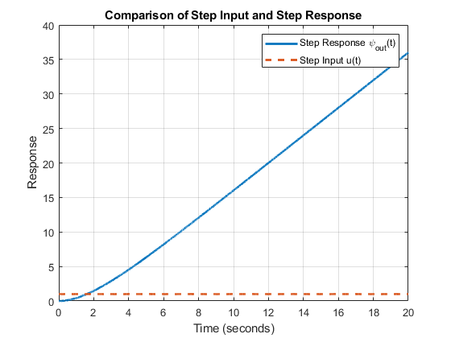
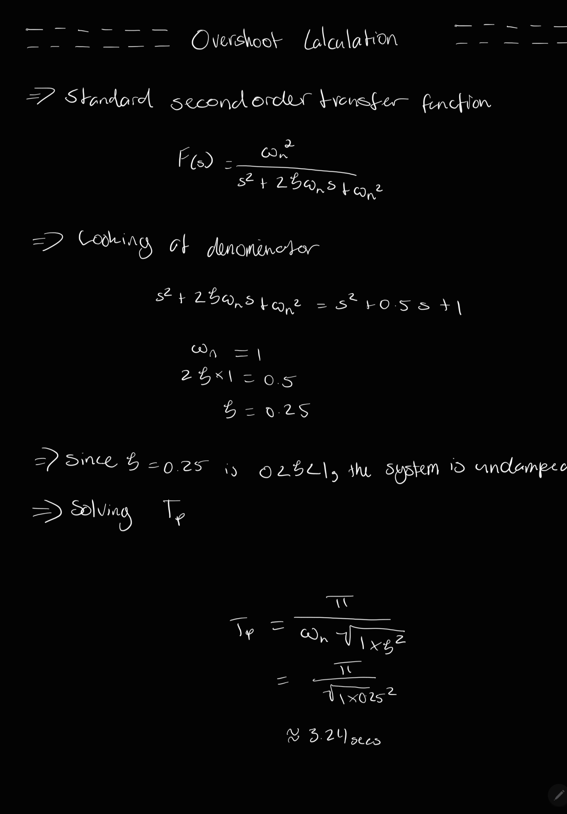

# BASA National Space Program: Radio Frequency and Telecommunication Division

**Group Number:** 98  
**Group Members:** Parker Rennie (n11543043), Jack Bowen (n10765395), Deven Johnson (n12031615)  
**Unit Name:** Signal Analysis
**Unit Code:** EGB242 

## Table of Contents

0. [Introduction](#introduction)
1. [Section 1: De-noising the Communication Channel](#section-1-de-noising-the-communication-channel)
   - [1.1 Audio Signal Analysis](#11-audio-signal-analysis)
   - [1.2 Demodulation of Audio Signals](#12-demodulation-of-audio-signals)
   - [1.3 Modeling Frequency-Dependent Distortion](#13-modeling-frequency-dependent-distortion)
   - [1.4 & 1.5 Noise Reduction & Application](#14--15-noise-reduction-application)
2. [Section 2: Rover Camera Control](#section-2-rover-camera-control)
   - [2.1 DC Motor Modeling](#21-dc-motor-modeling)
   - [2.2 Feedback System Integration](#22-feedback-system-integration)
   - [2.3 System Dynamics Analysis](#23-system-dynamics-analysis)
   - [2.4 Gain Adjustment Analysis](#24-gain-adjustment-analysis)
   - [2.5 Control System for Panoramic Views](#25-control-system-for-panoramic-views)
   - [2.6 Panorama Capture Task](#26-panorama-capture-task)
3. [Section 3: Choosing a Landing Site](#section-3-choosing-a-landing-site)
   - [3.1 Initial Image Analysis](#31-initial-image-analysis)
   - [3.2 Signal Analysis](#32-signal-analysis)
   - [3.3 Filter Selection](#33-filter-selection)
   - [3.4 Noise Removal and Image Cleanup](#34-noise-removal-and-image-cleanup)
   - [3.5 Full Image Set Processing](#35-full-image-set-processing)
4. [Conclusion](#conclusion)
5. [Reflection](#reflection)
   - [Learning & Understanding](#learning--understanding)
   - [Challenges & Limitations](#challenges--limitations)
   - [Future Improvements](#future-improvements)
   - [Teamwork & Collaboration](#teamwork--collaboration)
6. [References](#references)
7. [Appendices](#appendices)
   - [Appendix A: MATLAB Source Code](#appendix-a-matlab-source-code)
   - [Appendix B: Additional Material](#appendix-b-additional-material)

---

## Introduction
Following the success of the communication system developed during our initial placement at BASA, our team has been given an important role in the primary engineering team for the next crewed Mars expedition. We have made several improvements to improve performance further, building on the results of Assignment 1, where the system successfully kept clear and dependable contact between mission control and the spacecraft.

This expedition plans to send a rover to investigate the proposed settlement location for humans on Mars to create a permanent human habitat. The primary improvements include the use of Fourier Series in sophisticated noise reduction algorithms to get rid of the periodic noise and provide cleaner audio transmission. The method of converting analogue to digital has also been improved to lower latency and improve signal integrity. These improvements are essential as our team prepares for the MARS-242 mission.

Our work is divided into three main sections:
De-noising the Communication Channel: The spacecraft that is travelling towards Mars has been equipped with the communication system that was developed in Assignment 1. As the spacecraft leaves Earth's atmosphere, atmospheric distortions cause the audio to become inaudible even though the radio transmitter and receiver operate as designed. A colleague has created a more realistic channel model that includes additive noise and distortions that vary with frequency. To guarantee clear communication, we aim to describe and counteract these noise processes.

Rover Camera Control: Upon arrival, the astronauts will send out a rover to explore prospective landing locations on Mars. The rover will send pictures of these locations back to the spaceship so the astronauts can decide on a secure landing spot. The rover's camera angle and axis are essential to this procedure since it has to spin on its yaw axis to properly photograph the Martian terrain.

Choosing a Landing Site: Once the rover has successfully taken images of possible landing locations, the photos will be sent to BASA Headquarters, where an appropriate landing spot will be selected. Our team will also have to filter the extra noise the communication channel produces for the visual signals.

---

## Section 1: De-noising the Communication Channel

### 1.1 Audio Signal Analysis

#### Objective
The aim of this task is to use the sample audio signal provided, `audioMultiplexNoisy`, and the provided sampling rate `fs`. This section will model the multiplexed audio signal in the time and frequency domain in order to illuminate the invidual signals before multiplexing. This will also discuss any potential noising introduced by the channel after modulation.

#### Method
After loading `audioMultiplexNoisy` and `fs` from DataA2, the signal was first plotted in the time domain after expressing it as a time vector. The choice to apply a Hamming window was made because it offers a good balance between reducing spectral leakage and maintaining frequency resolution, which is particularly important when analyzing signals that may contain closely spaced frequency components (National Instruments, n.d.).

The Hamming window reduces spectral leakage, helping to more clearly distinguish the frequency components of the signal. After applying the Hamming window, the Fast Fourier Transform (FFT) was computed to convert the time-domain signal into the frequency domain. This allows for the analysis of the signal's spectral content.

A frequency vector was created and centered at 0 Hz to aid in visualizing the frequency components accurately. Finally, the FFT result was shifted using fftshift to center the zero-frequency component, and the magnitude of the frequency components was plotted against frequency. This frequency-domain plot provides insight into the spectral characteristics of the multiplexed audio signal.

#### Results

***Figure 1:** Recorded Audio Waveform in the Time Domain. This plot represents the amplitude of the noisy multiplexed audio signal over a 20-second time span, visualizing the time-domain behavior of the signal.*


***Figure 2:*** *Frequency Domain Plot of the Multiplexed Audio Signal. This plot shows the magnitude of the signal's frequency components, providing insight into the spectral characteristics of the signal after applying a Hamming window and computing the FFT.*

#### Analysis
As shown in **Figure 1**, the time-domain plot reveals a noisy signal with a broad range of amplitudes, indicating a composite of several frequencies and possibly some interference. The lack of periodicity suggests complex or multiplexed signal sources. **Figure 2** demonstrates how the application of a Hamming window helped in minimizing spectral leakage, allowing for a clearer view of the frequency components. Significant peaks in the frequency-domain plot indicate dominant frequencies within the audio signal, which are crucial for further analysis and filtering or demodulation. This detailed visualization of both time and frequency domains is essential for understanding the content and quality of the multiplexed signal and for any subsequent efforts to isolate or modify specific components of the audio.

### 1.2 Demodulation of Audio Signals

#### Objective
The aim of this analysis is to demodulate the multiplexed audio signals identified from a noisy environment. Using the demultiplexing system developed earlier, we locate the carrier frequencies of each modulated audio signal, demodulate each audio stream, assess the sound quality, and provide visualizations in both the time and frequency domains.

#### Method
A demultiplexing system was employed to identify and isolate carrier frequencies from the composite signal. After detecting the carrier frequencies, each associated signal was demodulated using a combination of the Hilbert transform and a bandpass filter tailored to the audio bandwidth specifications. Here's why these methods were chosen:

1. **Carrier Frequency Detection**: Carrier frequencies were detected using a peak detection method on the Fourier-transformed signal. This approach helps in identifying the precise frequencies where the signal components are concentrated, which are necessary for accurate demodulation. An example how this was implemented is as below.

```matlab
systemA = abs(fft_shifted_center);
%% Set peak values to filter out rogue frequencies
minPeakProminenceA = max(systemA) * 0.1;
minPeakDistanceA = 10000;

%% Took positive frequencies due to Fourier Symetry
positive_freqsA = fA(fA >= 0);
system_positiveA = systemA(fA >= 0);

%% Found peaks of carrier frequencies
[pkzA, loczA] = findpeaks(system_positiveA, 'MinPeakProminence', minPeakProminenceA, 'MinPeakDistance', minPeakDistanceA);
detected_carrier_frequenciesA = positive_freqsA(loczA);
```

2. **Hilbert Transform**:
   - The Hilbert transform is used to obtain the analytic signal from the real signal. The analytic signal consists of the original signal and its Hilbert transform, forming a complex signal.
   - This transform is crucial for demodulation as it helps in isolating the amplitude envelope and instantaneous phase, which are modulated around the carrier frequency.
   - Reference: (WaveMetrics, n.d.)

3. **Bandpass Filter**:
   - After shifting the frequency spectrum of the modulated signal to baseband using the Hilbert transform, a bandpass filter is applied. The purpose of the bandpass filter is to limit the frequency range to the essential bandwidth of the audio signal, typically around 20 Hz to 20 kHz for audible signals (Purves et al., 2001).
   - This filtering removes out-of-band noise and other spectral components that are not relevant to the audio content, thus enhancing the quality of the demodulated signal.

The combination of these techniques ensures that each demodulated signal is cleared of unnecessary spectral noise and retains only the audio frequencies of interest.

#### Results

***Figure 3:** Detected Carrier Frequencies in the Positive Frequency Range. Carrier frequencies are marked on the magnitude spectrum, indicating the presence of five distinct carrier signals.*


***Figure 4:** Demodulated Audio Signal 1 (Carrier: 8260 Hz). Time domain (top) shows the amplitude of the audio over time, while the frequency domain (bottom) displays the magnitude spectrum post-demodulation.*


***Figure 5:** Demodulated Audio Signal 2 (Carrier: 24240 Hz). The time domain graph indicates a relatively stable amplitude, and the frequency domain highlights dominant frequency components.*


***Figure 6:** Demodulated Audio Signal 3 (Carrier: 40260 Hz). Displays the time-domain waveform and its corresponding frequency spectrum, emphasizing the audio signal's detailed characteristics after demodulation.*


***Figure 7:** Demodulated Audio Signal 4 (Carrier: 56100 Hz). Shows amplitude fluctuations over time and a clear spectral view illustrating the effects of demodulation on the audio signal.*


***Figure 8:** Demodulated Audio Signal 5 (Carrier: 72080 Hz). Both the time and frequency domain plots reveal the audio signal's characteristics, with evident frequency peaks corresponding to the audio content.*

#### Analysis
- **Audio Quality**: Listening tests for each demodulated signal (as referenced in Figures 4 to 8) indicate a significant improvement in audio clarity, with a reduction in background noise musical tones.
- **Residual Noises**: Some residual noises that match the noise spectrum modeled in **Figure 1** of Section 1.1 are still present. These are likely artifacts from the original noising process and the carrier modulation. In particular the single tone noise.
- **Time and Frequency Domain Insights**:
  - The time domain plots (top graphs in Figures 4 to 8) show the waveform's amplitude variations over time, which are smooth and consistent, suggesting effective demodulation.
  - The frequency domain plots (bottom graphs in Figures 4 to 8) demonstrate clean spectral lines with the absence of high-frequency noise, indicating successful removal of the carrier frequencies and isolation of the audio signal.
- **Effectiveness of Demodulation**: The clarity in the frequency domain across all demodulated signals confirms that the carrier frequencies have been effectively removed, validating the demodulation process.

The analysis confirms that the demodulation process has successfully isolated each audio signal, reducing noise and improving audio quality. The persistence of some noise elements as originally modeled suggests areas for further refinement in the demultiplexing system or noise reduction techniques.

### 1.3 Modeling Frequency-Dependent Distortion

#### Objective
To model the frequency-dependent distortion introduced by a communication channel, characterized as a Linear Time-Invariant (LTI) system. The output \( y(t) \) is the convolution of the input signal \( x(t) \) with the channel's impulse response \( h(t) \):
\[ y(t) = x(t) * h(t) \]
We use the function `channel(sid, x, fs)` to simulate this behavior in a controlled environment.

#### Method
To accurately characterize the channel's impulse response \( h(t) \), we require a test signal \( x(t) \) that can effectively probe the channel's behavior across its operational bandwidth. While the Dirac delta function \( \delta(t) \) is ideal mathematically for its ability to reproduce the impulse response directly due to its sifting property:
\[ \delta(t) * h(t) = h(t) \]
it is impractical in real-world applications due to its infinite amplitude at \( t = 0 \) and zero elsewhere, making it impossible to physically generate.

Instead, a **chirp signal** is chosen:
\[ x(t) = \sin\left(2\pi f(t) t\right) \]
where \( f(t) \) linearly increases from 0 to \( \frac{fs}{2} \) over the duration of the signal. This chirp sweeps through all the frequencies in the desired range, allowing us to analyze how the channel affects different frequencies.

Mathematically, the chirp signal's interaction with the channel provides a comprehensive view of the frequency-dependent behavior:
\[ y(t) = (\sin(2\pi f(t) t) * h(t) \]
This convolution shows how the amplitude and phase of each frequency component are modified by \( h(t) \), giving a detailed picture of the channel's characteristics.

The analysis involved transmitting a chirp signal through the channel and measuring both the input and output signals in the time domain, as well as estimating the frequency response of the channel.

#### Results


***Figure 9:** Time-Domain Signals. The plot shows the input chirp signal (in blue) and the output signal (in red) as processed by the channel. The differences between these two signals reflect the distortions and modifications imparted by the channel. Additionally, Estimated Frequency Response |H(f)|. This plot represents the magnitude of the channel's frequency response derived from the ratio of the FFT of the output signal to the FFT of the input signal, demonstrating how various frequency components are affected by the channel. This was generated by using the channel analysis application built for this task with inputs of 5ms.*

#### Analysis

- **Time-Domain Analysis**:
  - The input chirp signal (blue) displays a clean and predictable frequency sweep over time.
  - The output signal (red) shows considerable distortion, especially noticeable by amplitude changes and phase shifts, which vary across the signal's duration.
  - The distortions in the output signal suggest nonlinearities or time-varying characteristics within the channel, which could be due to components within the channel altering the signal based on its frequency or amplitude.

- **Frequency-Domain Analysis**:
  - The frequency response plot (Figure 9) reveals multiple peaks and troughs, indicating resonant frequencies where the channel amplifies the signal and other frequencies where it attenuates the signal.
  - These variations in the frequency response can be linked to physical or electronic characteristics of the channel, such as capacitive, inductive, or resistive elements that differentially affect signal components.
  - Notably, there are significant deviations from a flat response, which would indicate a perfectly linear channel. This suggests that the channel has a complex response that could potentially introduce artifacts or coloration into transmitted signals.

#### Limitations
- **Time Resolution**: The finite length of the chirp limits the time resolution available for analyzing the channel's response, potentially smoothing over rapid changes in channel behavior.
- **Frequency Resolution**: The chirp covers a wide frequency range but at the cost of precision in identifying the exact frequency at which certain phenomena occur, especially for very sharp resonances or notches.
- **Assumptions of Linearity**: The analysis assumes the channel behaves linearly, which the time-domain output signal suggests may not be entirely accurate. Nonlinear behaviors require different analytical approaches or signal processing techniques to fully characterize.

### 1.4 & 1.5 Noise Reduction Application

#### Objective
The objective of this task is to apply modeled inverse channel distortions to reduce noise in multiplexed audio signals, followed by the removal of remaining single-tone noises using notch filters, in order to improve the overall audio clarity. 

The two main goals are:
1. Reverse the distortions caused by the channel to restore the original signal.
2. Eliminate any residual noise, particularly the high-pitched single-tone noise, that remains after initial noise reduction.

#### Method
The method for noise reduction consists of two key steps:

##### 1. Inverse Filtering
Inverse filtering aims to correct the frequency-dependent distortion introduced by the communication channel. By using the estimated frequency response \( H(f) \) of the channel, an inverse filter is constructed, effectively reversing the distortion.

1. **Filter Design**: The inverse filter is designed based on the channel's frequency response. A reasonable number of filter coefficients are chosen to ensure that the filter remains computationally feasible while retaining its ability to correct the distortions.
   - A **Hamming window** is applied to the filter coefficients to stabilize the filter by reducing spectral leakage. The Hamming window is chosen because it provides a balance between mainlobe width and sidelobe attenuation, making it ideal for minimizing ringing artifacts in the filtered output.

2. **Inverse FFT Calculation**: After obtaining the frequency response of the channel, the inverse filter is computed by applying the **Inverse Fast Fourier Transform (IFFT)** to the estimated frequency response.
   - The computed IFFT provides the time-domain representation of the inverse filter. Only the first set of coefficients is used, windowed by the Hamming function to smooth the transition between passband and stopband, further enhancing filter stability.

3. **Application**: The designed inverse filter is then applied to the noisy multiplexed audio signal using convolution. This process attempts to reverse the distortions introduced by the channel, producing a denoised signal.

4. **Noise Frequency Detection**: After applying the inverse filter, the **FFT** is computed on the denoised signal. By detecting peaks in the magnitude spectrum, high-pitched noise frequencies are identified. These peaks are expected to correspond to the remaining single-tone noises present in the signal.

##### 2. Single-Tone Noise Removal
After applying the inverse filter, some high-pitched single-tone noise may still persist. These tones are addressed through the following steps:

1. **Bandpass Filtering**: Each carrier frequency is filtered using a **bandpass FIR filter** to isolate the relevant frequency range, allowing us to focus on each component of the multiplexed signal individually.

2. **Hilbert Transform and Envelope Detection**: After isolating the frequency band for each carrier, the **Hilbert transform** is applied to obtain the analytic signal. The envelope (magnitude) of the analytic signal is extracted, representing the original modulated audio signal.

3. **Low-Pass Filtering**: To remove any residual high-frequency content, the envelope is passed through a **low-pass FIR filter**, which suppresses frequencies above 3000 Hz, ensuring that only the audio-relevant frequencies are retained.

4. **Notch Filtering for Noise Removal**: **Notch filters** are applied at the detected noise frequencies, effectively eliminating the high-pitched single-tone noises without affecting the surrounding frequencies. The notch filters are designed as bandstop IIR filters with a narrow stopband centered on the detected noise frequencies.

5. **Dynamic Range Compression**: After noise removal, **dynamic range compression** is applied to balance the audio signal's amplitude. This process ensures that the loudest parts of the audio do not exceed a certain threshold, while quieter parts are amplified, producing a more consistent audio output.

#### Results

The following are the time-domain and frequency-domain visualizations of the processed audio signals for different carrier frequencies:

- **Processed Signal for 8260 Hz**
  
  ***Figure 10:** Shows improvements in waveform smoothness, with the frequency spectrum indicating a significant reduction in noise.*

- **Processed Signal for 24240 Hz**
  
  ***Figure 11:** The time-domain plot demonstrates smoother amplitude variations, and the frequency spectrum shows clearer components with reduced noise artifacts.*

- **Processed Signal for 40260 Hz**
  
  ***Figure 12:** Displays a more consistent waveform in the time domain. The frequency domain plot indicates a clean spectrum with significantly less noise.*

- **Processed Signal for 56100 Hz**
  
  ***Figure 13:** The amplitude in the time domain is more uniform, and the frequency-domain plot reveals cleaner signal characteristics, highlighting effective noise reduction.*

- **Processed Signal for 72080 Hz**
  
  ***Figure 14:** Time-domain shows smoother amplitude, and the frequency-domain plot confirms a notable reduction in background noise, emphasizing the success of the noise reduction techniques.*

#### Analysis

- **Time-Domain Analysis**: The time-domain plots of the processed signals (Figures 10-14) show significant improvements in waveform consistency, with smoother amplitude transitions and less abrupt noise-induced fluctuations.
  
- **Frequency-Domain Analysis**: The frequency-domain plots show a marked reduction in noise across all frequencies. The processed signals demonstrate less spectral energy in areas typically associated with noise, indicating that the inverse filtering and notch filters effectively mitigated unwanted noise components.

- **Noise Reduction Efficacy**: The combined approach of inverse filtering and single-tone noise removal significantly improved the audio quality, reducing background noise and artifacts while maintaining the integrity of the original signal. The effectiveness of the noise reduction can be seen in both the time and frequency domains for all carrier frequencies.

- **Residual Noise**: While the overall noise reduction is substantial, some residual low-level noise may still be present in certain frequencies, particularly in regions where the signal strength is weaker. However, the presence of such noise is minimal and does not significantly affect the overall audio quality. In some case the tone is still persistent meaning it was not entirely effective. The playback of the audio signals can be done via a application built for this task `Audio Playback App`.

#### Conclusion

The noise reduction process, which involved inverse filtering and the removal of single-tone noise, has been effective in enhancing the quality of the multiplexed audio signals. The processed signals now exhibit smooth waveforms in the time domain and clean spectra in the frequency domain, indicating successful suppression of unwanted noise components, however in some recordings still persistence of the single tone noise is evident. Thus other filtering techniques may be required.

---

## Section 2: Rover Camera Control

### 2.1 DC Motor Modeling

#### Objective
In this section, the aim was to develop and analyze the mathematical model of the servo motor controlling the yaw angle, \( \psi(t) \), of a camera mounted on our Mars rover. The model was based on the transfer function in the Laplace domain, given the motor's characteristics with parameters \( K_m = 1 \) and \( \alpha = 0.5 \). The feasibility of the system was evaluated by deriving the step response of the servo motor in the Laplace domain using the given transfer function and performing an inverse Laplace transform to obtain the time-domain representation of the motor's response to a unit step input in voltage. A time vector was generated over the interval \( t \in [0, 20) \) seconds with \( 10^4 \) samples, and both the step input and the corresponding step response were simulated and plotted to visualize how the yaw angle \( \psi(t) \) evolves over time.

#### Method

**Laplace Domain Analysis was conducted:**
The transfer function of the servo motor was defined as:
\[
G_m(s) = \frac{K_m}{s(s + \alpha)}
\]
where \( K_m = 1 \) and \( \alpha = 0.5 \). The Laplace transform of a unit step input voltage, \( U(s) = \frac{1}{s} \), was applied to determine the system's response in the Laplace domain.

**Inverse Laplace Transform was applied:**
The expression obtained from multiplying the motor's transfer function by the unit step input,
\[
\frac{K_m}{s^2(s + \alpha)}
\]
was simplified using partial fractions. The inverse Laplace transform of each term in the partial fraction decomposition was calculated to obtain the time-domain response, \( \psi_{out}(t) \). Resultantly, the system response can be modeled as such:
\[
\psi_{out} = -4 + 2t + 4e^{-0.5t}
\]

**A time vector and simulation were created:**
A time vector \( t \) was generated using `linspace` to produce \( 10^4 \) evenly spaced samples over the interval from 0 to 20 seconds. The step response \( \psi_{out}(t) \) was computed over this time vector using the derived time-domain formula.

**Plotting was performed:**
The step response \( \psi_{out}(t) \) was plotted alongside the step input to visually compare the system's output behavior to the constant input voltage. Plotting tools that supported annotations and grid lines were utilized to enhance the readability and interpretation of the plot.

This approach provided a systematic exploration of the servo motor's capability to effectively control the yaw angle of a Mars rover’s camera, highlighting areas requiring potential enhancements.

#### Results

***Figure 15:** This graph displays the comparison between the step input and the step response over a time interval of 0 to 20 seconds. The step input, represented as a dashed line, remains constant throughout the period, illustrating the constant voltage applied to the servo motor. The solid line depicts the step response, \( \psi_{out}(t) \), which shows the yaw angle of the camera as it evolves over time due to the applied input voltage. The response increases proportionally with time indicated by its linearity.*

#### Analysis
The response in *Figure 15* clearly illustrates that under a constant input voltage, the camera's yaw angle \( \psi_{out}(t) \) does not converge to a constant value. Instead, it continues to increase linearly with time.The linear behavior of the response suggests that there is no damping or stabilizing mechanism inherent in the system that would cause the yaw angle to level off or stabilize at a certain point, which could be necessary for precise control and positioning of the camera. Given that the yaw angle does not stabilize, additional control mechanisms, such as feedback systems or damping components, might be required to achieve desired control objectives like reaching and maintaining a specific yaw angle. The system as modeled might be insufficient for tasks that require the camera to fix on a particular target or to perform sweeps and then hold at a specific view, indicating the potential need for revising the motor control strategy or incorporating other elements like sensors and feedback loops. 

### 2.2 Feedback System Integration

#### Objective
The objective of this section was to enhance control of the Mars rover’s camera by integrating a feedback system using a potentiometer. The feedback system aimed to stabilize the yaw angle \( \psi(t) \) and prevent continuous rotation, allowing the camera to hold a specific angular position.

#### Method
To model the feedback system, a potentiometer was added to provide feedback on the motor’s angular displacement. The transfer function for the motor \( G_m(s) \) is:
\[
G_m(s) = \frac{K_m}{s(s + \alpha)}
\]
where \( K_m = 1 \) and \( \alpha = 0.5 \). The feedback from the potentiometer, modeled as \( H_p(s) = K_{pot} = 1 \), was used to adjust the motor’s input by measuring the yaw angle displacement. The closed-loop transfer function for the system became:
\[
F(s) = \frac{G_m(s)}{1 + G_m(s) \cdot H_p(s)}
\]
This transfer function was then simulated using MATLAB’s `tf` object and the `lsim` function, with the same time vector as in section 2.1. The step response of the feedback system was plotted and compared to the open-loop system response.

#### Results


***Figure 16 (Feedback System):** The step response of the feedback system, shown below, demonstrates significant improvement. The feedback introduces oscillations but quickly stabilizes the camera’s yaw angle to the desired value. The system initially overshoots but settles to the steady-state value of 1, which corresponds to the step input. This stabilization occurs due to the corrective action provided by the feedback loop.*

#### Analysis
Comparing the open-loop and feedback systems shows the effectiveness of adding the potentiometer for feedback control. 

- **Without Feedback (Figure 15):** The yaw angle increases linearly and does not stabilize, indicating the system lacks any self-correction mechanism. This makes it unsuitable for controlling angular displacement, as the camera will continue to rotate indefinitely after a step input.

- **With Feedback (Figure 16):** The feedback system, however, introduces damping and control over the yaw angle. The feedback helps the system correct its response and stabilize the yaw angle at the desired value. Although there is some initial overshoot and oscillation, the system eventually settles at the target angle. This behavior makes the feedback system far more suitable for precise control of the Mars rover’s camera, ensuring that it can lock onto and maintain a specific orientation.

Overall, the feedback system is critical for ensuring stable and controlled operation of the camera’s angular displacement. The oscillations introduced by the feedback loop represent the system’s ability to correct itself over time, achieving stability, which was not possible with the open-loop system.


### 2.3 System Dynamics Analysis

#### Objective
The objective of this section was to analyze the dynamics of the feedback system used for controlling the Mars rover's camera. By determining key parameters such as the natural frequency \( \omega_n \), damping ratio \( \zeta \), time to peak \( T_p \), settling time \( T_s \), and percentage overshoot \( \%OS \), we assess the performance of the system in achieving stable and precise yaw angle control.

#### Method
To analyze the feedback system, we derived the following parameters from the transfer function and the step response of the closed-loop system:
- **Natural Frequency (\( \omega_n \))**: This defines the system’s natural tendency to oscillate without damping.
- **Damping Ratio (\( \zeta \))**: This defines the extent of oscillation damping. A damping ratio between 0 and 1 indicates an underdamped system with oscillations.
- **Time to Peak (\( T_p \))**: The time taken for the system to reach its maximum overshoot.
- **Settling Time (\( T_s \))**: The time required for the system to remain within 2% of its final value.
- **Percentage Overshoot (\( \%OS \))**: The extent to which the system exceeds its final value during oscillations.

The calculations were performed based on the standard formulas for second-order systems, given that the system was identified as underdamped (\( 0 < \zeta < 1 \)).

#### Results
The table below summarizes the key dynamic properties of the feedback system:

| **Parameter**                | **Value**              | **Description**                                                 |
|------------------------------|------------------------|-----------------------------------------------------------------|
| Natural Frequency (\( \omega_n \))  | 1.00 rad/s            | The system oscillates with this frequency in the absence of damping. |
| Damping Ratio (\( \zeta \))        | 0.25                  | The system is underdamped, indicating oscillatory behavior.        |
| Time to Peak (\( T_p \))            | 3.24 seconds          | Time taken to reach the first peak of overshoot.                  |
| Settling Time (\( T_s \))           | 16.00 seconds         | Time taken for the system to settle within 2% of the final value.  |
| Percentage Overshoot (\( \%OS \))   | 44.43%                | The amount the system overshoots its target value.                |

#### Analysis
The feedback system, while introducing stabilization to the yaw angle, exhibits significant oscillations, as evidenced by the high percentage overshoot of 44.43%. The system's dynamics are as follows:

- **Underdamped Behavior**: With a damping ratio \( \zeta = 0.25 \), the system is underdamped, meaning it exhibits oscillations before reaching a steady state. The overshoot and oscillations, though damped over time, could cause the camera to temporarily exceed its desired angular position.
  
- **Time to Peak**: The system takes approximately 3.24 seconds to reach its first peak. This delay, coupled with the high overshoot, may result in the camera taking longer to stabilize when fine-tuning its position.

- **Settling Time**: The system requires around 16 seconds to settle within 2% of its final value, which might be too long for real-time operations where quick adjustments of the camera’s orientation are critical.

- **High Overshoot**: The percentage overshoot of 44.43% means the yaw angle exceeds the desired position significantly before correcting itself. This is particularly problematic when the camera needs to remain within specific bounds, such as \( 0 \leq \psi(t) \leq 2\pi \) radians. Any overshoot could result in the camera overshooting its target angle and then correcting, causing inefficiency in real-time control.

Given these dynamics, the feedback system as currently designed may not be fully appropriate for controlling the Mars rover's camera, where precision and stability are paramount. To improve the system's suitability, the damping ratio could be increased to reduce oscillations and overshoot, or additional control strategies (such as a PID controller) could be implemented to enhance the system's response.


### 2.4 Gain Adjustment Analysis

#### Objective
The objective of this section was to refine the control of the Mars rover's camera yaw angle by adjusting system gains. Specifically, we introduced forward gain \( K_{fwd} \) and feedback gain \( K_{fb} \) to investigate their effects on the system’s step response. The goal was to find optimal gain settings that minimize overshoot and settling time while ensuring stability and precision in the yaw angle control.

#### Method
To assess the impact of gain changes, we modified the closed-loop transfer function by introducing:
- **Forward gain**: \( G_g(s) = K_{fwd} \)
- **Feedback gain**: \( H_g(s) = K_{fb} \)

Two sets of simulations were conducted:
1. **Varying \( K_{fb} \) while keeping \( K_{fwd} = 1 \)**: The feedback gain \( K_{fb} \) was adjusted through values \( \{0.1, 0.2, 0.5, 1.0, 2.0\} \).
2. **Varying \( K_{fwd} \) while keeping \( K_{fb} = 1 \)**: The forward gain \( K_{fwd} \) was adjusted through values \( \{0.1, 0.2, 0.5, 1.0, 2.0\} \).

For each combination, we simulated the system using MATLAB and plotted the step response to compare the effects of varying the gains.

#### Results
  
  

  ***Figure 16:** Step Response for Varying \( K_{fb} \) with \( K_{fwd} = 1. \) As \( K_{fb} \) increases, the system's response becomes more stable, with a reduction in overshoot and quicker settling time. Higher values of \( K_{fb} \) (e.g., 2.0) result in a smoother response, while lower values (e.g., 0.1) cause the system to overshoot significantly, with a longer settling time.*
<p>
  
  

  ***Figure 17:** Step Response for Varying \( K_{fwd} \) with \( K_{fb} = 1.\) Adjusting \( K_{fwd} \) changes the aggressiveness of the system's response. Higher values of \( K_{fwd} \) (e.g., 2.0) lead to significant oscillations and overshoot, while smaller values (e.g., 0.1) provide a more controlled response with reduced oscillations. However, very low values of \( K_{fwd} \) can make the system too sluggish.*

#### Analysis
From the results:
1. **Feedback Gain \( K_{fb} \)**: Increasing \( K_{fb} \) reduces overshoot and improves stability. For example, \( K_{fb} = 2.0 \) provides a more damped response with minimal oscillations, making it suitable for precise control of the camera's yaw angle. However, too high a feedback gain may lead to under-responding to input changes.

2. **Forward Gain \( K_{fwd} \)**: Higher values of \( K_{fwd} \) cause the system to respond more aggressively, increasing overshoot and causing oscillations. Moderate values of \( K_{fwd} \) (around 1.0) offer a balanced response, but careful tuning is required to avoid excessive oscillations and instability.

In conclusion, the feedback gain \( K_{fb} \) plays a crucial role in stabilizing the system, and the forward gain \( K_{fwd} \) must be chosen carefully to avoid excessive oscillations while maintaining responsiveness. For this system, a higher \( K_{fb} \) (e.g., 2.0) combined with a moderate \( K_{fwd} \) (e.g., 1.0) provided the best overall performance for controlling the Mars rover’s camera.


### 2.5 Control System for Panoramic Views

#### Objective
The primary objective of this section was to fine-tune the control system of the Mars rover's camera to facilitate panoramic sweeps across the Mars landscape. The control system needed to be configured to allow the camera to rotate smoothly and precisely through a full range of 0 to \(2\pi\) radians, without exceeding the operational constraints that could result in blurred images due to too rapid movement.

#### Method
The method involved iterative adjustments to the gain settings of the control system. Based on previous sections' analyses, the key focus was on:
- Increasing the forward gain \( K_{fwd} \) to enhance the responsiveness of the system, allowing it to reach the desired angular range within a specified time frame.
- Maintaining the feedback gain \( K_{fb} \) to ensure system stability and avoid overshoots that could lead to oscillations or instability in the camera movement.

Specifically, the following steps were taken:
1. **Determine the desired natural frequency and damping ratio** from the system's requirements for a smooth and controlled motion.
2. **Calculate and adjust the forward and feedback gains** based on the desired time to peak and the full angular rotation requirement.
3. **Simulate the system** with the new settings to observe the response and ensure it meets the panoramic requirements.

#### Results
The final transfer function, denoted as `cameraTF`, was configured with the adjusted gain settings. The forward gain \( K_{fwd} \) was set to approximately 0.300, and the feedback gain \( K_{fb} \) was maintained at approximately 0.125. The system's response with these settings was simulated to verify the performance.

The simulation results confirmed that the system could now effectively sweep the camera through a full rotation of \(2\pi\) radians in less than 20 seconds, achieving a smooth and controlled motion suitable for capturing high-quality panoramic images.


***Figure 18:** Improved Step Response of the Camera Control System showcasing the capability to reach over \(2\pi\) radians within 20 seconds, tailored for panoramic sweeps.*

#### Analysis
The analysis of the step response and the system's overall behavior with the adjusted gains indicated several key points:
- **System Responsiveness:** The increased \( K_{fwd} \) effectively shortened the time required for the camera to reach the full rotational range, addressing the initial sluggishness observed in prior configurations.
- **Stability and Control:** The feedback gain \( K_{fb} \) ensured that despite the increased speed, the system remained stable without significant overshoots or oscillations, crucial for maintaining image clarity during movement.
- **Operational Efficiency:** The system meets the operational requirements for capturing panoramic views on Mars, with a motion profile that aligns well with the camera's specifications to avoid motion blur.

In conclusion, the camera control system is now optimally configured to perform sweeping panoramas of the Mars landscape, ensuring high-quality image capture with precise and controlled rotational movements.

### 2.6 Panorama Capture Task

#### Objective
The objective of this task was to capture a panoramic sweep on Mars using the Mars rover's camera system. The sweep aimed to cover a specific angular range from 30° to 210°, providing a broad view of the landing site to aid in orienting the rover and planning subsequent missions.

#### Method
The control system was implemented with the following calibrated settings to ensure precise control over the camera's rotational movement:

- **Start Angle**: 30°, corresponding to 0.52 radians.
- **End Angle**: 210°, corresponding to 3.67 radians, adjusted to correct for a previously observed endpoint of 228°.
- **Voltage Settings**: The start voltage was set at 0.08 V, and the end voltage was initially calculated at 0.58 V but corrected to ensure the camera stops precisely at 210°.

The process involved:
1. **Converting angles to radians** for internal calculations.
2. **Mapping these radians to voltages** that the camera control system uses to position the camera.
3. **Executing the panorama** through the `cameraPan` function, which utilizes the camera control system's transfer function (`cameraTF`) to drive the camera from the start voltage to the corrected end voltage.

#### Results
The panoramic sweep was successfully captured as planned:

- **Starting Image**: The panorama began at an angle of 30°, providing an initial view of the Mars terrain directly in front of the rover.
- **Final Image**: The sweep concluded at the corrected angle of 210°, showing a comprehensive view extending to the far landscape features, useful for mission planning and navigation.


***Figure 19:** Starting and Final Images from the Panoramic Sweep on Mars*

The adjusted settings resulted in a smooth panoramic sweep, achieving the desired angular coverage without any observable overshoot or instability in the camera movement.

#### Analysis
The panoramic sweep demonstrated that the adjusted voltage settings effectively compensated for any previous discrepancies in the camera's angular placement. The resulting images show a clear and stable transition from the start to the end point of the desired panorama:

- **Voltage Calibration**: The adjustments to the end voltage ensured that the camera did not overshoot the intended final angle, addressing the initial 18° discrepancy effectively.
- **Panoramic Coverage**: The sweep covered the intended angles, providing valuable visual data from the Mars surface.
- **System Performance**: The camera control system responded accurately to the voltage inputs, confirming the effectiveness of the calibration process and the reliability of the system under Martian conditions.

This task's success is pivotal for the ongoing exploration and utilization of visual data in planning the rover's movements and activities on Mars.

---

## Section 3: Choosing a Landing Site

### 3.1 Initial Image Analysis

#### Objective
The primary objective of this analysis is to assess the first received image of a potential landing site on Mars. This assessment aims to identify and characterize noise and other distortions that might affect the usability of the image for mission planning.

#### Method
The received image was displayed and examined to evaluate its quality. The main focus was on identifying noise patterns and any distortions that could compromise the image's clarity and usefulness for identifying suitable landing terrain.

#### Results
The first received image shows significant visual noise, impacting the overall clarity:

- **Visual Quality**: The image displays a considerable amount of graininess, with noise distributed across the entire image. This graininess could mask finer surface details that are crucial for assessing the landing site's safety.
- **Noise Characteristics**: The noise pattern appears uniform, suggesting it might be due to electronic or transmission noise rather than environmental factors on Mars.
- **Detail Obscuration**: The noise level is high enough that smaller features such as rocks or smaller geographical formations might not be distinguishable. This could complicate the assessment of potential hazards at the landing site.


*Figure 20: First Received Image of Landing Site*

#### Analysis
The quality of the image as received is suboptimal for detailed analysis due to the high level of noise. This could be attributed to several factors:

- **Transmission Issues**: The noise pattern suggests issues with the communication channel, possibly a high level of electronic interference or a suboptimal transmission bitrate.
- **Sensor Sensitivity**: The camera sensor's sensitivity to the Martian environment or the rover's electronic environment might need calibration to reduce the noise.
- **Potential Remedies**: Applying digital filters or enhancing techniques might improve the image quality for better analysis. Further adjustments in the rover’s communication hardware or protocols might also be required to enhance future image transmissions.

Given the current state of the image, it is recommended to conduct a more detailed analysis using advanced image processing techniques to filter out noise and enhance the image. This process should be repeated with subsequent images to ensure consistent improvements in image quality for mission-critical decisions.


### 3.2 Signal Analysis

#### Objective
Analyze the image signal in time and frequency domains.

#### Method
Construct and plot the necessary vectors.

#### Results
Identify noise components and their characteristics.

### 3.3 Filter Selection

#### Objective
Choose the appropriate filter for noise removal.

#### Method
Analyze different filters based on provided schematics.

#### Results
Justify the selection of a specific filter type.

### 3.4 Noise Removal and Image Cleanup

#### Objective
Apply the selected filter to clean the image signal.

#### Method
Implement the filtering process.

#### Results
Display the cleaned image and assess the removal of noise.

### 3.5 Full Image Set Processing

#### Objective
Repeat the noise removal process for all images.

#### Method
Factorize and implement the de-noising process.

#### Results
Display cleaned images and provide landing site recommendations.

---

## Conclusion

*Summarize the key findings, the effectiveness of the noise removal and control systems, and any conclusions drawn from the project.*

---

## Reflection

### Learning & Understanding
*Summarize key learnings from the project.*

### Challenges & Limitations
*Discuss the main challenges and limitations faced.*

### Future Improvements
*Propose potential improvements for future projects.*

### Teamwork & Collaboration
*Reflect on teamwork and collaboration during the project.*

---

## References
National Instruments. (n.d.). Understanding FFTs and windowing. Available at: https://download.ni.com/evaluation/pxi/Understanding%20FFTs%20and%20Windowing.pdf.

Purves D, Augustine GJ, Fitzpatrick D, et al., editors. Neuroscience. 2nd edition. Sunderland (MA):Sinauer Associates; 2001. The Audible Spectrum. Available at:https://www.ncbi.nlm.nih.gov/books/NBK10924/

WaveMetrics. (n.d.). Hilbert Transform. Available at: https://www.wavemetrics.com/products/igorpro/dataanalysis/signalprocessing/hilberttransform

---

## Appendices

### Appendix A: MATLAB Source Code

*Include raw source code relevant to the tasks completed.*

### Appendix B: Additional Material

#### Working 2.1


#### Working 2.2


#### Working 2.3


